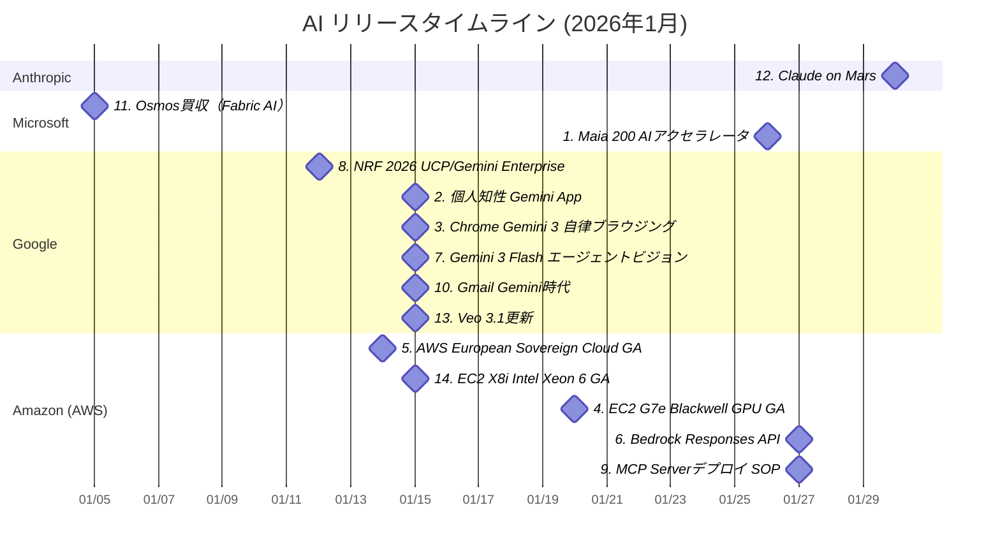

# AI技術動向レポート: 2026年1月

> **対象企業**: OpenAI / Anthropic / Microsoft / Google / Amazon (AWS) / Meta
> **調査期間**: 2026-01-01 〜 2026-01-31
> **生成日**: 2026-03-14
> **対象読者**: クラウド・オンプレ基盤の企画・開発・運用を担当するIT技術者

---

## 目次

- [リリースタイムライン](#リリースタイムライン)
- [注目トピックス](#注目トピックス)
  - [AI活用提案サマリー](#ai活用提案サマリー)

---

## リリースタイムライン

各トピックスのリリース時期を以下に示す。数字はトピックスの番号と対応している。

---

## 注目トピックス

> 14 件のアップデートを注目度順に紹介します。

### AI活用提案サマリー

今月のリリース・アップデートの中で、**クラウド・オンプレ基盤担当のIT技術者**が特に注目すべき活用シナリオをまとめます。

| 優先度 | サービス・機能 | 活用シナリオ | 期待効果 |
| ------ | ------------- | ------------ | -------- |
| ★★★ | Microsoft Maia 200 | Microsoft Foundry経由でGPT-5.2の大規模推論ワークロードを評価 | GPUクラウドコスト削減・推論レイテンシ改善 |
| ★★★ | Google Personal Intelligence (Gemini App) | Google Workspace連携でナレッジワーカーの生産性向上 | 情報収集・文書作成の効率化 |
| ★★★ | Chrome Gemini 3 Auto-browse | ブラウザ上の反復ウェブ作業をAIエージェントに委譲 | RPA代替・ウェブ操作の自動化 |
| ★★★ | Amazon EC2 G7e（Blackwell） | 大規模LLM推論をG7eオンデマンドで評価 | 推論コスト最適化・70Bモデルの低コスト運用 |
| ★★★ | AWS European Sovereign Cloud | GDPR要件を満たすBedrock/SageMakerをEUSCで活用 | 規制準拠のAIサービス基盤構築 |
| ★★★ | Amazon Bedrock Responses API | サーバーサイドツールでBedrockエージェントの機能を拡張 | 開発工数圧縮・APIコスト削減 |
| ★★☆ | Gemini 3 Flash Agentic Vision | 製造・物流向け画像AI品質検査のPoC評価 | ハルシネーション低減による精度向上 |
| ★★☆ | Universal Commerce Protocol（UCP） | AIエージェントによるBtoB発注自動化のPoC | 発注業務の省力化 |
| ★★☆ | AWS MCP Server デプロイ SOP | AI IDEからのIaC自動生成を試用 | インフラ展開の自動化・速度向上 |
| ★★☆ | Gmail Gemini Era | Google Workspace導入組織でのメール作業効率計測 | ナレッジワーカー生産性の定量化 |
| ★★☆ | Microsoft Osmos × Fabric | ETL自動化の将来ロードマップを把握し移行計画へ組み込み | データ基盤構築コストの削減 |
| ★★☆ | Claude on Mars（Anthropic） | エッジ・高遅延環境での自律AIエージェントアーキテクチャ検討 | オフライン・高遅延環境での自律AI活用可能性の把握 |
| ★☆☆ | Google Veo 3.1 | AI動画生成の社内コンテンツ制作への活用 | 動画制作コストの削減 |
| ★☆☆ | Amazon EC2 X8i | SAP HANA・インメモリDB移行のTCO評価 | オンプレとのコスト比較によるクラウド移行判断 |

> **凡例**: ★★★ 今すぐ評価推奨 / ★★☆ 近い将来検討 / ★☆☆ 動向ウォッチ推奨

---

### 1. Microsoft Maia 200 — 自社開発AIインフェレンスチップが本格稼働

| 項目 | 内容 |
| ---- | ---- |
| 会社 | Microsoft |
| カテゴリ | 新製品リリース |
| リリース日 | 2026年1月26日 |

**TSMC 3nmプロセス・140B以上のトランジスタを搭載した推論特化型AIアクセラレータがクラウドで稼働開始**

- FP4で>10 petaFLOPS、FP8で>5 petaFLOPS、HBM3e 216GB（7 TB/s）搭載のMaia 200が米国中部（Iowa）で稼働。
- AWS Trainium 3比3倍のFP4性能、Google TPU v7のFP8性能を超え、前世代比30%コスト改善。
- GPT-5.2モデルをMicrosoft Foundry・Microsoft 365 Copilotに提供。
- Maia SDKプレビューも公開。

📘 **用語解説**:
- **FP4/FP8**: AIチップの演算精度（4ビット/8ビット浮動小数点）
- **HBM3e**: 高帯域幅メモリ第3世代
- **petaFLOPS**: 1秒間に1000兆回の浮動小数点演算性能

🔗 **情報源**:
- [Maia 200: The AI accelerator built for inference](https://blogs.microsoft.com/blog/2026/01/26/maia-200-the-ai-accelerator-built-for-inference/)

💡 **AI活用提案**:
- Microsoft Foundry経由でGPT-5.2の大規模推論ワークロードを評価し、自社のAIインフラコスト削減の試算を行ってみてください。

---

### 2. Google — Gemini Appに個人知性（Personal Intelligence）機能が登場

| 項目 | 内容 |
| ---- | ---- |
| 会社 | Google |
| カテゴリ | 新サービスリリース |
| リリース日 | 2026年1月（米国ベータ） |

**GmailやGoogleフォト・YouTubeをGeminiに連携し、個人コンテキストを活かした高度なアシスタント機能が提供開始**

- Gemini AppにPersonal Intelligence機能が追加。
- Gmail、Googleフォト、YouTube、Google検索履歴を接続することでユーザー個人の状況を踏まえた回答が可能に。
- AI Mode in Searchでも同機能が展開（Google AI Pro/Ultra向け）。
- パーソナル情報を核にしたAIアシスタントの新段階。

🔗 **情報源**:
- [Google AI updates: January 2026](https://blog.google/innovation-and-ai/products/google-ai-updates-january-2026/)

💡 **AI活用提案**:
- Google WorkspaceのGemini統合機能を評価し、社内の情報検索・個人生産性向上ユースケースへの活用を検討してみてください。

---

### 3. Google Chrome — Gemini 3による自律ブラウジング（Auto-browse）が開始

| 項目 | 内容 |
| ---- | ---- |
| 会社 | Google |
| カテゴリ | 機能アップデート |
| リリース日 | 2026年1月 |

**ChromeブラウザにGemini 3が統合され、複数ステップのウェブタスクを自律実行するAIエージェント機能が提供開始**

- ChromeにGemini 3が組み込まれ、予約・フォーム入力・比較調査などのウェブ上の多段階タスクを自律実行するauto-browse機能が利用可能に。
- Nano Banana機能による画像変換も追加。
- エンドユーザーの反復ウェブ作業のエージェント化を実現する。

🔗 **情報源**:
- [Google AI updates: January 2026](https://blog.google/innovation-and-ai/products/google-ai-updates-january-2026/)

💡 **AI活用提案**:
- 社内でChromeを業務ツールとして活用している場合、auto-browse機能によるボイラープレート作業の自動化とRPA代替の可能性を評価してみてください。

---

### 4. Amazon EC2 G7e — NVIDIA RTX PRO 6000 Blackwell GPUを搭載した推論特化インスタンスがGA

| 項目 | 内容 |
| ---- | ---- |
| 会社 | Amazon (AWS) |
| カテゴリ | 新サービスリリース |
| リリース日 | 2026年1月20日 |

**NVIDIA RTX PRO 6000 Blackwell（各96GB VRAM）搭載、前世代G6e比2.3倍の推論性能、単一GPUで70Bモデルのロードが可能**

- EC2 G7eインスタンスが一般提供開始。
- 最大8GPU構成で768GBのGPUメモリを提供。
- FP8精度で70Bパラメータモデルを単一GPU上でロード可能。
- 生成AIインフェレンスと高精度グラフィックスワークロードに対応。

📘 **用語解説**:
- **Blackwell**: NVIDIAの最新GPU世代コードネーム
- **VRAM**: GPU内蔵の専用メモリ
- **FP8**: 8ビット浮動小数点演算精度

🔗 **情報源**:
- [Announcing Amazon EC2 G7e instances](https://aws.amazon.com/blogs/aws/announcing-amazon-ec2-g7e-instances-accelerated-by-nvidia-rtx-pro-6000-blackwell-server-edition-gpus/)

💡 **AI活用提案**:
- オンプレミスでGPUサーバーを検討中の場合、G7eの従量課金との混在構成を評価し、大規模LLM推論の総保有コストを試算してみてください。

---

### 5. AWS European Sovereign Cloud — EU域内独立クラウドが一般提供開始

| 項目 | 内容 |
| ---- | ---- |
| 会社 | Amazon (AWS) |
| カテゴリ | 新サービスリリース |
| リリース日 | 2026年1月14日 |

**EU域内で物理・論理的に独立したクラウドリージョン（eusc-de-east-1、ブランデンブルク）が全顧客向けにGA。BedrockおよびSageMakerも利用可能**

- EU規制対象の公共機関・金融・医療など向けに、データレジデンシーとガバナンス独立性を保証するAWSクラウドが稼働。
- EU外からのアクセスを技術的に遮断し、IAMと課金システムも完全独立。
- Amazon SageMakerおよびAmazon Bedrockも起動時から利用可能。
- 投資額は78億ユーロ。

🔗 **情報源**:
- [Opening the AWS European Sovereign Cloud](https://aws.amazon.com/blogs/aws/opening-the-aws-european-sovereign-cloud/)

💡 **AI活用提案**:
- GDPR対応や欧州顧客向けAIサービス提供を検討中の場合、EUSCリージョンでのBedrock/SageMakerを活用したデータソブリンティ実現の要件整理を行ってみてください。

---

### 6. Amazon Bedrock Responses API — サーバーサイドカスタムツール使用が可能に

| 項目 | 内容 |
| ---- | ---- |
| 会社 | Amazon (AWS) |
| カテゴリ | 機能アップデート |
| リリース日 | 2026年1月下旬 |

**Responses APIでウェブ検索・コード実行・DB更新などのカスタムツールをAWSセキュリティ境界内で実行可能に。プロンプトキャッシュに1時間TTLも追加**

- Amazon Bedrock Responses APIにサーバーサイドのカスタムツール使用機能が追加。
- ウェブ検索・コード実行・DB更新等のツール呼び出しをAWSセキュリティ境界内で実行できる。
- 加えてプロンプトキャッシュに1時間TTLが追加され、長時間・多ターンエージェントのパフォーマンスとコストが改善。

🔗 **情報源**:
- [Amazon Bedrock server-side custom tools in Responses API](https://aws.amazon.com/about-aws/whats-new/2026/01/amazon-bedrock-server-side-custom-tools-responses-api/)

💡 **AI活用提案**:
- 既存のBedrock Responses APIを利用中の場合、サーバーサイドツールで外部API連携を簡略化し、プロンプトキャッシュ1時間TTLによるコスト削減効果を検証してみてください。

---

### 7. Google Gemini 3 Flash — エージェントビジョン（Agentic Vision）で視覚推論を強化

| 項目 | 内容 |
| ---- | ---- |
| 会社 | Google |
| カテゴリ | 機能アップデート |
| リリース日 | 2026年1月 |

**Gemini 3 Flashに「エージェントビジョン」機能が追加。単一スナップショットではなく能動的に画像を探索する方式でハルシネーションを低減**

- Gemini 3 FlashのAgentic Vision機能により、モデルが画像の詳細を能動的に「探索」するモードが追加。
- 一度きりのスナップショット推論から脱し、複数回の観察で正確な視覚推論が可能に。
- Gemini APIおよびVertex AI経由で利用できる。

📘 **用語解説**:
- **Agentic Vision（エージェントビジョン）**: AIが画像を能動的に繰り返し観察して推論する方式
- **ハルシネーション**: AIが事実と異なる内容を自信を持って生成する現象

🔗 **情報源**:
- [Google AI updates: January 2026](https://blog.google/innovation-and-ai/products/google-ai-updates-january-2026/)

💡 **AI活用提案**:
- 画像分類・品質検査・ドキュメント読み取りなどのビジョンAIを検討中の場合、Vertex AI上でAgentic Visionをプロトタイプし、ハルシネーション改善効果を評価してみてください。

---

### 8. Google — NRF 2026にてUniversal Commerce Protocol（UCP）とGemini Enterpriseを発表

| 項目 | 内容 |
| ---- | ---- |
| 会社 | Google |
| カテゴリ | 新サービスリリース |
| リリース日 | 2026年1月12日 |

**NRF 2026でSundar Pichai基調講演。AIエージェント向けEC取引オープン標準UCPと法人向けGemini Enterpriseを発表。ドローン配送の拡大も発表**

- NRF 2026でGoogleがUniversal Commerce Protocol（UCP）を発表。
- AIエージェントが安全にEC決済・注文を実行できるオープン標準で、AI Mode検索やGemini Appからのエージェント購入を可能にする。
- 同時に法人向けGemini Enterpriseも発表。

🔗 **情報源**:
- [Google AI updates: January 2026](https://blog.google/innovation-and-ai/products/google-ai-updates-january-2026/)

💡 **AI活用提案**:
- ECやBtoBの注文処理を担当している場合、UCPの仕様策定を注視し、AIエージェントによる発注自動化のPoCを計画してみてください。

---

### 9. AWS — MCP Serverデプロイメントエージェント SOP（プレビュー）が公開

| 項目 | 内容 |
| ---- | ---- |
| 会社 | Amazon (AWS) |
| カテゴリ | 機能アップデート |
| リリース日 | 2026年1月下旬（プレビュー） |

**自然言語プロンプトでAWSリソースをデプロイできるMCPサーバー向けエージェントSOPがプレビュー。Kiro・Cursor・Claude Codeから利用可能**

- Kiro、Cursor、Claude Codeなどのエージェント対応IDEから自然言語でAWSリソースのデプロイを指示できるMCPサーバー向けSOP（Standard Operating Procedure）がプレビュー公開。
- CDKインフラコードとCloudFormationテンプレートを自動生成する。

📘 **用語解説**:
- **MCP (Model Context Protocol)**: AIエージェントがツール・サービスを呼び出すための標準プロトコル
- **IaC (Infrastructure as Code)**: インフラ構成をコードで管理する手法
- **CDK (Cloud Development Kit)**: プログラミング言語でAWSリソースを定義するIaCツール

🔗 **情報源**:
- [AWS Weekly Roundup (February 2, 2026)](https://aws.amazon.com/blogs/aws/aws-weekly-roundup-amazon-bedrock-responses-api-sagemaker-unified-studio-and-more-february-2-2026/)

💡 **AI活用提案**:
- KiroやCursorなどのAI IDEを採用中の場合、MCP SOP経由でIaC自動生成を試し、インフラ展開の自動化による工数削減効果を評価してみてください。

---

### 10. Gmail — Gemini時代の無料AI機能が全ユーザーに展開

| 項目 | 内容 |
| ---- | ---- |
| 会社 | Google |
| カテゴリ | 機能アップデート |
| リリース日 | 2026年1月 |

**「Help me write」「AI Overviews」「返信提案」が全Gmailユーザーに無料提供。有料プランはAI Inboxをトラスティドテスターに公開**

- Gmail全ユーザー向けに「Help me write」（メール下書き生成）・AI Overviews（スレッド要約）・スマート返信提案が無償で展開。
- 有料プランの信頼テスター向けにはAI Inboxも公開。
- エンタープライズでのGoogle Workspaceを含む生産性向上が加速。

🔗 **情報源**:
- [Google AI updates: January 2026](https://blog.google/innovation-and-ai/products/google-ai-updates-january-2026/)

💡 **AI活用提案**:
- Google Workspaceを導入中の場合、Gmail AIアシスト機能の利用状況を計測し、社内メールコミュニケーションの効率改善効果をROI試算してみてください。

---

### 11. Microsoft — Osmosを買収してFabricの自律データエンジニアリングを加速

| 項目 | 内容 |
| ---- | ---- |
| 会社 | Microsoft |
| カテゴリ | 注目ニュース |
| リリース日 | 2026年1月5日 |

**データ統合・変換の自動化を得意とするOsmosを買収。Microsoft Fabricへの組み込みで自律型データエンジニアリングを加速する方針を発表**

- Microsoftがデータ変換自動化スタートアップのOsmosを買収。
- Microsoft Fabricに統合することでETL/ELT処理の自動化・AI主導のデータパイプライン構築を強化する計画。
- データエンジニアリングの生産性向上が期待される。

🔗 **情報源**:
- [Microsoft announces acquisition of Osmos](https://blogs.microsoft.com/blog/2026/01/05/microsoft-announces-acquisition-of-osmos-to-accelerate-autonomous-data-engineering-in-fabric/)

💡 **AI活用提案**:
- Microsoft Fabricを検討中の場合、Osmos統合後のデータ変換自動化機能のロードマップを確認し、ETL作業の自動化計画に組み込んでみてください。

---

### 12. Anthropic Claude — NASAパーサビアランス探査機の火星自律走行を支援

| 項目 | 内容 |
| ---- | ---- |
| 会社 | Anthropic |
| カテゴリ | 注目ニュース |
| リリース日 | 2026年1月30日 |

**ClaudeがNASA火星探査機Perseveranceの自律走行を支援し、火星表面400メートルの走行を達成。地球外惑星でのAI活用として世界初の事例**

- AnthropicのClaudeが地球外AIアシスト走行の世界初事例を達成。
- NASAのPerseverance探査機がClaude支援のもと火星表面を400メートル自律走行。
- 地球との通信遅延がある環境での自律型AIエージェントの有効性が実証された。

🔗 **情報源**:
- [Anthropic News](https://www.anthropic.com/news)

💡 **AI活用提案**:
- エッジまたは通信遅延が大きい環境でのAIエージェント活用を検討中の場合、Claude APIの自律実行機能を評価し、低遅延要件でのオフライン推論アーキテクチャを設計してみてください。

---

### 13. Google Veo 3.1 — ダイアログ強化・縦型出力・4Kアップスケーリングに対応

| 項目 | 内容 |
| ---- | ---- |
| 会社 | Google |
| カテゴリ | 機能アップデート |
| リリース日 | 2026年1月 |

**動画生成モデルVeo 3.1がアップデート。対話シーンの自然さ向上、ネイティブ縦型出力（YouTube Shorts対応）、4Kアップスケーリングが追加**

- Veo 3.1で動画内のダイアログ品質が向上し、より自然な会話シーンを生成可能に。
- YouTube Shorts向けネイティブ縦型出力と4K解像度へのアップスケーリングが追加。
- クリエイティブコンテンツ制作の幅が広がる。

🔗 **情報源**:
- [Google AI updates: January 2026](https://blog.google/innovation-and-ai/products/google-ai-updates-january-2026/)

💡 **AI活用提案**:
- マーケティングや社内コンテンツ制作にAI動画生成を活用中の場合、Veo 3.1のショート動画・4K対応を試し、映像制作コストの削減試算を行ってみてください。

---

### 14. Amazon EC2 X8i — カスタムIntel Xeon 6搭載のメモリ最適化インスタンスがGA

| 項目 | 内容 |
| ---- | ---- |
| 会社 | Amazon (AWS) |
| カテゴリ | 新サービスリリース |
| リリース日 | 2026年1月15日 |

**AWS専用カスタムIntel Xeon 6プロセッサ搭載のメモリ最適化EC2インスタンスがGA。SAP認定済みで同クラス最高のメモリ帯域幅を実現**

- Amazon EC2 X8iインスタンスがGA。
- AWS独自カスタムIntel Xeon 6プロセッサを搭載し、同等Intelプロセッサ比で最高のメモリ帯域幅をクラウドで提供。
- SAP認定済みでSAP HANA・大規模インメモリDB・分析ワークロードに最適。

🔗 **情報源**:
- [Amazon EC2 X8i instances](https://aws.amazon.com/blogs/aws/amazon-ec2-x8i-instances-powered-by-custom-intel-xeon-6-processors-are-generally-available-for-memory-intensive-workloads/)

💡 **AI活用提案**:
- SAP HANAや大規模インメモリDBをオンプレミスで運用中の場合、X8iインスタンスとのコスト比較検証を行い、クラウド移行TCOを評価してみてください。

---

> **備考**:
>
> - **OpenAI**: 2026年1月中に公式ニュースページで確認できる新製品・新機能のリリースはありませんでした（GPT-5は2025年8月7日リリース済み）。
> - **Meta**: 2026年1月中に `ai.meta.com/blog/` で確認できるAI関連の主要リリースはありませんでした。
