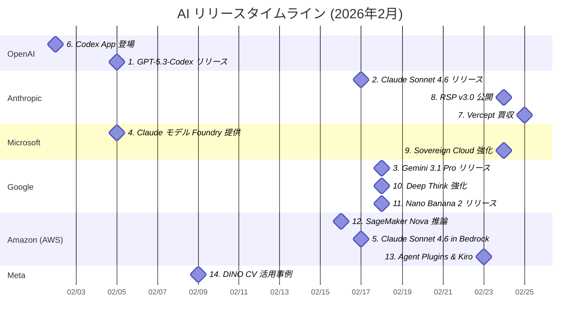

# AI技術動向レポート: 2026年2月

> **対象企業**: OpenAI / Anthropic / Microsoft / Google / Amazon (AWS) / Meta
> **調査期間**: 2026-02-01 〜 2026-02-28
> **生成日**: 2026-03-11
> **対象読者**: クラウド・オンプレ基盤の企画・開発・運用を担当するIT技術者

---

## 目次

- [リリースタイムライン](#リリースタイムライン)
- [注目トピックス](#注目トピックス)
  - [AI活用提案サマリー](#ai活用提案サマリー)

---

## リリースタイムライン

各トピックスのリリース時期を以下に示す。数字はトピックスの番号と対応している。

---

## 注目トピックス

> 14 件のアップデートを注目度順に紹介します。

### AI活用提案サマリー

今月のリリース・アップデートの中で、**クラウド・オンプレ基盤担当の IT 技術者**が特に注目すべき活用シナリオをまとめます。

| 優先度 | サービス・機能 | 活用シナリオ | 期待効果 |
| ------ | ------------- | ------------ | -------- |
| ★★★ | GPT-5.3-Codex | CI/CD へのコーディングエージェント統合、コードレビュー・テスト自動生成 | 開発工数削減、コード品質向上 |
| ★★★ | Claude Sonnet 4.6（Bedrock／Foundry） | 高ボリューム API 呼び出しでの文書要約・コード生成 | Opus 比でコスト削減、精度維持 |
| ★★★ | Gemini 3.1 Pro | 既存 Gemini ベースシステムのモデルアップグレード | 推論精度2倍向上、複雑タスク品質改善 |
| ★★☆ | Codex App & CLI | 開発者向け AI ネイティブ開発環境の社内展開評価 | 開発生産性向上、コーディング体験改善 |
| ★★☆ | Agent Plugins for AWS | IaC 自動生成・AWS デプロイコスト可視化の自動化 | インフラ管理コスト削減 |
| ★★☆ | SageMaker + custom Nova | 社内データでのカスタムモデル本番デプロイ | ドメイン特化モデルの安定運用実現 |
| ★★☆ | Microsoft Sovereign Cloud | 機密システムへの AI 展開、コンプライアンス対応 | 規制業界でのオフライン AI 活用 |
| ★★☆ | Claude Computer Use（Vercept 買収） | GUI ベース社内システムの RPA 代替エージェント化 | レガシーシステム自動化の新手法 |
| ★☆☆ | Gemini 3 Deep Think | R&D・技術設計レビューへの AI 推論支援 | 技術文書生成・設計検証の効率化 |
| ★☆☆ | Nano Banana 2 / Lyria 3 | 社内コンテンツ生成（画像・音楽）の高速化 | マーケ・デザイン部門の自動化 |
| ★☆☆ | Meta DINO | 施設・インフラ点検へのコンピュータビジョン適用 | 現地調査コスト削減 |

> **凡例**: ★★★ 今すぐ評価推奨 / ★★☆ 近い将来検討 / ★☆☆ 動向ウォッチ推奨

---

### 1. GPT-5.3-Codex リリース

| 項目 | 内容 |
| ---- | ---- |
| 会社 | OpenAI |
| カテゴリ | 新製品リリース |
| リリース日 | 2026年2月5日 |

**SWE-Bench Pro SOTA 達成・サイバーセキュリティ「High」初認定の最先端コーディングエージェント**

- OpenAI の最先端自律コーディングモデル。
- SWE-Bench Pro・Terminal-Bench 2.0・OSWorld-Verified の3ベンチマークで最高スコア達成。
- GPT-5.2-Codex 比25%高速化。
- 業界初のサイバーセキュリティ能力「High」認定モデルであり、OpenAI 史上初めて自身の開発に貢献。
- 有料 ChatGPT・Codex CLI/IDE で利用可能。

📘 **用語解説**:
- **SWE-Bench**: 実際のGitHubイシューを解決するソフトウェアエンジニアリング能力の評価基準
- **OSWorld**: AIエージェントのOS操作能力を評価するベンチマーク

🔗 **情報源**:
- [Introducing GPT-5.3-Codex](https://openai.com/index/introducing-gpt-5-3-codex/)

💡 **AI活用提案**:
- CI/CD パイプラインへのコーディングエージェント統合でコードレビュー・テスト自動生成を検討してください。API 経由で既存の開発フローへの組み込みも可能です。

---

### 2. Claude Sonnet 4.6 リリース

| 項目 | 内容 |
| ---- | ---- |
| 会社 | Anthropic |
| カテゴリ | 新製品リリース |
| リリース日 | 2026年2月17日 |

**コーディング・エージェント・大規模業務処理でフロンティア性能をコスト効率良く提供**

- Anthropic のミッドレンジ最新版。
- コーディング・エージェントタスク・業務スケール処理において Opus 4.6 レベルの知性を低コストで提供。
- 高ボリュームコーディングおよびナレッジワーク用途に最適化。
- API 利用即日対応。
- Amazon Bedrock・Microsoft Foundry でも同時期に提供開始された。

🔗 **情報源**:
- [Introducing Claude Sonnet 4.6](https://www.anthropic.com/news/claude-sonnet-4-6)

💡 **AI活用提案**:
- エンタープライズ向けコード生成・ドキュメント自動化の基盤として評価してください。Opus 比でコスト削減しつつ高精度を維持できるため、高頻度 API 呼び出しシナリオに最適です。

---

### 3. Gemini 3.1 Pro リリース

| 項目 | 内容 |
| ---- | ---- |
| 会社 | Google |
| カテゴリ | 新製品リリース |
| リリース日 | 2026年2月（詳細日程非公開） |

**Gemini 3 Pro 比で推論性能 2 倍を実現した Google 最新フラッグシップモデル**

- Google の最新フラッグシップ AI モデル。
- Gemini 3 Pro 比で推論性能が2倍に向上し、複雑な問題解決・マルチステップ推論・コーディング支援での精度が大幅改善。
- Google AI Studio・Gemini API 経由で開発者向けに提供。
- 企業・コンシューマー向けにも順次展開。

🔗 **情報源**:
- [Google AI updates: February 2026](https://blog.google/innovation-and-ai/products/google-ai-updates-february-2026/)

💡 **AI活用提案**:
- 現在 Gemini 3 Pro を使用している社内システムの 3.1 Pro へのアップグレード効果を検証してください。推論精度向上により、要約・分析タスクの品質改善が期待できます。

---

### 4. Claude Opus 4.6 & Sonnet 4.6 が Microsoft Foundry で提供開始

| 項目 | 内容 |
| ---- | ---- |
| 会社 | Microsoft |
| カテゴリ | 新サービスリリース |
| リリース日 | 2026年2月5日（Opus）／ 2026年2月17日（Sonnet） |

**Azure 環境で Anthropic 最新モデルを IAM・VNet 統合のままエンタープライズ利用可能に**

- Claude Opus 4.6（2月5日）と Sonnet 4.6（2月17日）が Microsoft Foundry で利用可能になった。
- Azure の IAM・VNet・コンプライアンス環境内でシームレスに呼び出せるため、既存 Azure 基盤を持つ企業が追加インフラなしに最新 Claude モデルを活用できる。

🔗 **情報源**:
- [Claude Opus 4.6 in Microsoft Foundry](https://azure.microsoft.com/en-us/blog/claude-opus-4-6-anthropics-powerful-model-for-coding-agents-and-enterprise-workflows-is-now-available-in-microsoft-foundry-on-azure/)

💡 **AI活用提案**:
- Azure 環境で運用中のアプリケーションに Claude モデルを統合する PoC を検討してください。既存の Azure IAM・監査ログ基盤をそのまま活用できる点が評価ポイントです。

---

### 5. Claude Sonnet 4.6 が Amazon Bedrock で利用可能に

| 項目 | 内容 |
| ---- | ---- |
| 会社 | Amazon (AWS) |
| カテゴリ | 新サービスリリース |
| リリース日 | 2026年2月17日 |

**Bedrock の推論・ガードレール・エージェント機能と組み合わせて即日利用可能**

- Claude Sonnet 4.6 が Amazon Bedrock で利用可能になった。
- Opus 4.6 レベルの知性をコスト効率良く提供。
- Bedrock の推論プロファイル・ガードレール・ナレッジベース・エージェント機能との組み合わせが可能で、既存 AWS ワークロードへの統合が容易。
- GovCloud 対応も予定。

🔗 **情報源**:
- [Claude Sonnet 4.6 available in Amazon Bedrock](https://aws.amazon.com/about-aws/whats-new/2026/02/claude-sonnet-4.6-available-in-amazon-bedrock/)

💡 **AI活用提案**:
- Bedrock ベースのアプリケーションで Claude Opus 4.6 を使用している場合、Sonnet 4.6 へ切り替えてコスト削減効果を検証してください。精度を維持しながら API コスト圧縮が期待できます。

---

### 6. Codex App 登場

| 項目 | 内容 |
| ---- | ---- |
| 会社 | OpenAI |
| カテゴリ | 新製品リリース |
| リリース日 | 2026年2月2日 |

**GPT-5.3-Codex の能力を最大限に活用するための専用スタンドアロンコーディングアプリ**

- GPT-5.3-Codex 特化の専用スタンドアロンアプリ。
- ChatGPT とは別軸でコーディングエージェントに特化した UX を提供。
- Codex CLI・IDE 拡張と合わせ、開発ツールチェーン全体で AI ネイティブな開発体験を実現する。
- 開発チームへの段階的展開に適したオプション。

🔗 **情報源**:
- [OpenAI News](https://openai.com/news/)

💡 **AI活用提案**:
- 社内開発者向けの AI コーディング環境として先行評価導入を検討してください。Codex CLI は既存のターミナルワークフローとも統合しやすく、段階的な展開が可能です。

---

### 7. Anthropic が Vercept を買収

| 項目 | 内容 |
| ---- | ---- |
| 会社 | Anthropic |
| カテゴリ | 注目ニュース |
| リリース日 | 2026年2月25日 |

**GUI オートメーション専門企業の買収で Claude の Computer Use 能力を大幅強化**

- Anthropic は GUI オートメーション・スクリーン理解専門の Vercept を買収。
- Claude の「Computer Use」能力の高度化が主目的であり、将来的な Claude エージェントによるデスクトップ・ブラウザ操作精度の大幅向上が期待される。
- エージェントによる GUI ベース自動化の実用性が高まる。

📘 **用語解説**:
- **Computer Use**: AIが人間と同様にPCの画面を見てマウス・キーボードを操作できる機能
- **GUI オートメーション**: ボタン・メニューなどの画面要素を自動操作する技術

🔗 **情報源**:
- [Anthropic acquires Vercept](https://www.anthropic.com/news/anthropic-acquires-vercept)

💡 **AI活用提案**:
- RPA 代替として AI エージェント + Computer Use シナリオを中期ロードマップに組み込んでください。GUI ベースの社内レガシーシステム自動化への活用が見込まれます。

---

### 8. 責任ある拡張ポリシー（RSP）v3.0 公開

| 項目 | 内容 |
| ---- | ---- |
| 会社 | Anthropic |
| カテゴリ | 注目ニュース |
| リリース日 | 2026年2月24日 |

**AI 安全評価フレームワーク第3版。エンタープライズ AI 調達・ガバナンスの参照基準として価値向上**

- Anthropic が責任ある拡張ポリシー（RSP）第3版を公開。
- AI モデルの能力評価・危険域判定・安全基準の枠組みを更新。
- GPT-5.3-Codex が「High」サイバーセキュリティ能力として初認定されたことを受け、業界標準の安全評価フレームワークとして参照価値が高まっている。

📘 **用語解説**:
- **RSP (責任ある拡張ポリシー)**: AIモデルの危険能力を評価し安全基準を定めたAnthropicの社内ガバナンス文書

🔗 **情報源**:
- [Responsible Scaling Policy v3.0](https://www.anthropic.com/news/responsible-scaling-policy-updates)

💡 **AI活用提案**:
- AI 調達・ガバナンス方針の策定時に RSP v3.0 を参照基準として活用してください。社内 AI リスク評価フレームワーク構築の参考資料として最適です。

---

### 9. Microsoft Sovereign Cloud — 完全オフライン環境での大規模 AI モデル実行対応

| 項目 | 内容 |
| ---- | ---- |
| 会社 | Microsoft |
| カテゴリ | 機能アップデート |
| リリース日 | 2026年2月24日 |

**ネットワーク切断状態でも大規模 AI モデルを安全に実行できるソブリンクラウド機能を追加**

- Microsoft Sovereign Cloud がガバナンス強化・生産性向上・完全ネットワーク切断状態での大規模 AI モデル実行機能を追加。
- 政府機関・防衛・金融などの規制業界や機密データ処理環境で、クラウド接続なしに Azure AI 機能を活用できる環境を提供する。

🔗 **情報源**:
- [Microsoft Sovereign Cloud disconnected AI support](http://aka.ms/MicrosoftSovereignCloudDisconnectedBlog)

💡 **AI活用提案**:
- 機密情報を扱うオンプレミス・政府系システムへの AI 展開戦略として評価してください。コンプライアンス要件の厳しい日本の金融・医療・公共セクターでの活用に注目です。

---

### 10. Gemini 3 Deep Think メジャーアップグレード

| 項目 | 内容 |
| ---- | ---- |
| 会社 | Google |
| カテゴリ | 機能アップデート |
| リリース日 | 2026年2月（詳細日程非公開） |

**科学・工学特化の高度推論モデルが実用的な成果物を出力する能力を大幅強化**

- Google の高度推論特化モデル「Gemini 3 Deep Think」がメジャーアップグレード。
- 科学・工学分野の複雑な問題に対して実際に活用できるアクション可能な成果物を提供することに重点を置いて設計されている。
- 次世代の研究支援・技術設計支援ツールとして位置づけられている。

🔗 **情報源**:
- [Google AI updates: February 2026](https://blog.google/innovation-and-ai/products/google-ai-updates-february-2026/)

💡 **AI活用提案**:
- R&D チームや IT インフラ設計チームで Deep Think を試験的に活用し、設計レビューや技術調査の補助ツールとして評価してください。

---

### 11. Nano Banana 2 画像生成モデル & 創作ツールアップデート

| 項目 | 内容 |
| ---- | ---- |
| 会社 | Google |
| カテゴリ | 新製品リリース |
| リリース日 | 2026年2月（詳細日程非公開） |

**Pro 品質と Flash 速度を両立した新世代画像生成モデル、音楽・動画生成ツールも同時強化**

- Google が「Nano Banana 2」をリリース。
- Gemini 3 Pro レベルの画像品質を Flash のスピードで実現し開発者向けに提供。
- 合わせて音楽生成モデル「Lyria 3」と統合型画像・動画制作ワークスペース「Flow」のアップデートを発表。
- Google のマルチモーダル AI プラットフォームが大幅に拡張された。

🔗 **情報源**:
- [Google AI updates: February 2026](https://blog.google/innovation-and-ai/products/google-ai-updates-february-2026/)

💡 **AI活用提案**:
- マーケティング・デザイン部門向けの社内コンテンツ生成基盤として Imagen API の評価を検討してください。高速生成ニーズには Nano Banana 2 が最適なオプションです。

---

### 12. Amazon SageMaker Inference for custom Amazon Nova models

| 項目 | 内容 |
| ---- | ---- |
| 会社 | Amazon (AWS) |
| カテゴリ | 新サービスリリース |
| リリース日 | 2026年2月16日 |

**カスタムファインチューン済み Nova モデルを SageMaker の柔軟なインフラで本番運用可能に**

- カスタムファインチューニングした Amazon Nova モデルを Amazon SageMaker Inference で展開可能になった。
- インスタンスタイプ・オートスケーリングポリシー・同時実行数を個別設定でき、コストと性能のバランスを最適化しながら本番運用できる。
- ファインチューン → デプロイの MLOps パイプライン構築が容易になった。

🔗 **情報源**:
- [Amazon SageMaker Inference for custom Amazon Nova models](https://aws.amazon.com/blogs/aws/announcing-amazon-sagemaker-inference-for-custom-amazon-nova-models/)

💡 **AI活用提案**:
- 社内データでファインチューニングした Nova モデルの本番デプロイ計画を検討してください。既存の SageMaker MLOps インフラをそのまま活用したカスタムモデル運用が実現します。

---

### 13. Agent Plugins for AWS & Kiro の AWS GovCloud 対応

| 項目 | 内容 |
| ---- | ---- |
| 会社 | Amazon (AWS) |
| カテゴリ | 機能アップデート |
| リリース日 | 2026年2月23日 |

**コーディングエージェントに AWS デプロイ能力を追加するオープンソースプラグイン、政府向け Kiro も展開**

- オープンソースの「Agent Plugins for AWS」が公開。
- `deploy-on-aws` プラグインによりコーディングエージェントがアーキテクチャ提案・コスト見積もり・IaC コード生成を直接実行可能に。
- AWS の AI ネイティブ IDE「Kiro」が GovCloud（US）リージョンに対応し、規制業界での利用が可能になった。

📘 **用語解説**:
- **IaC (Infrastructure as Code)**: インフラ構成をコードで定義・管理する手法
- **GovCloud**: 米国政府機関向けAWSの特別分離リージョン

🔗 **情報源**:
- [AWS Weekly Roundup: February 23, 2026](https://aws.amazon.com/blogs/aws/aws-weekly-roundup-claude-sonnet-4-6-in-amazon-bedrock-kiro-in-govcloud-regions-new-agent-plugins-and-more-february-23-2026/)

💡 **AI活用提案**:
- IaC（Terraform / CDK）の自動生成・レビュー自動化に Agent Plugins の導入を検討してください。デプロイコストの可視化と最適化を AI エージェントに委譲できます。

---

### 14. Meta DINO を活用した社会インフラ最適化事例

| 項目 | 内容 |
| ---- | ---- |
| 会社 | Meta |
| カテゴリ | 注目ニュース |
| リリース日 | 2026年2月9日 |

**自己教師ありビジョンモデル DINO が英国の政府コスト削減・緑地整備に実用化**

- Meta の自己教師あり学習コンピュータビジョンモデル「DINO」が英国の緑地マッピングと政府コスト最適化に活用された事例が公開。
- 衛星画像・地図データからの緑地領域自動検出により現地調査コストを大幅削減。
- 政府・公共インフラ向け AI の実用例として注目を集める。

📘 **用語解説**:
- **DINO**: Metaが開発した自己教師あり学習を用いたコンピュータビジョンモデル
- **自己教師あり学習**: ラベルなしデータから特徴を自律的に学習するAI手法

🔗 **情報源**:
- [Reducing Government Costs and Increasing Access to Greenspaces with DINO](https://ai.meta.com/blog/)

💡 **AI活用提案**:
- 施設管理・インフラ点検への自己教師あり学習・コンピュータビジョンの適用を検討してください。DINO のオープンソースモデルは独自データへのファインチューニングにも対応しています。
