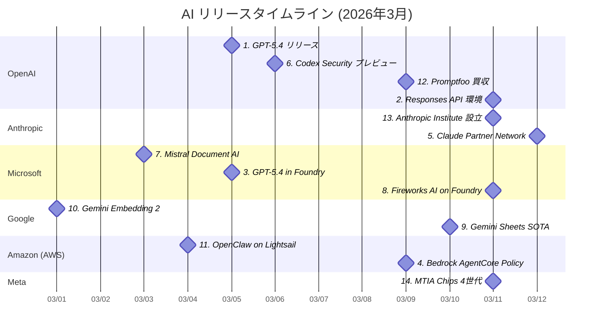

# AI技術動向レポート: 2026年3月

> **対象企業**: OpenAI / Anthropic / Microsoft / Google / Amazon (AWS) / Meta
> **調査期間**: 2026-03-01 〜 2026-03-14
> **生成日**: 2026-03-14
> **対象読者**: クラウド・オンプレ基盤の企画・開発・運用を担当するIT技術者

---

## 目次

- [リリースタイムライン](#リリースタイムライン)
- [注目トピックス](#注目トピックス)
  - [AI活用提案サマリー](#ai活用提案サマリー)

---

## リリースタイムライン

各トピックスのリリース時期を以下に示す。数字はトピックスの番号と対応している。

---

## 注目トピックス

> 14 件のアップデートを注目度順に紹介します。

### AI活用提案サマリー

今月のリリース・アップデートの中で、**クラウド・オンプレ基盤担当の IT 技術者**が特に注目すべき活用シナリオをまとめます。

| 優先度 | サービス・機能 | 活用シナリオ | 期待効果 |
| ------ | ------------- | ------------ | -------- |
| ★★★ | GPT-5.4 | コンピュータ操作・知識業務エージェントの本番評価開始 | 業務自動化範囲の大幅拡大、人間超えのPC操作精度 |
| ★★★ | Responses API コンピュータ環境 | シェルツール＋コンテナによるエージェントループの構築 | 開発者側ハーネス不要、マルチステップ業務を単一APIで完結 |
| ★★★ | GPT-5.4 in Microsoft Foundry | Azure 環境での最新モデル即時評価・企業向けデプロイ | 既存 Azure エコシステムを活かした最先端モデル活用 |
| ★★★ | Bedrock AgentCore Policy GA | エージェント-ツール接続の自然言語ポリシー一元管理 | AI エージェントのセキュリティ・コンプライアンス対応加速 |
| ★★☆ | Codex Security（研究プレビュー） | コードベースのセキュリティ脆弱性自動発見・修正 | セキュリティレビューコストの削減と検出率向上 |
| ★★☆ | Fireworks AI on Microsoft Foundry | Azure 上でのオープンモデル低レイテンシ推論 | 推論速度重視ワークロードでコスト最適化 |
| ★★☆ | Mistral Document AI in Foundry | PDF・帳票・スキャン文書の高精度構造化データ抽出 | 非構造化文書処理ワークフローの自動化 |
| ★★☆ | Gemini in Google Sheets SOTA | スプレッドシートでの数式生成・データ分析の AI 支援 | Google Workspace 業務の生産性向上 |
| ★★☆ | Gemini Embedding 2 | テキスト＋画像混在ナレッジベースのマルチモーダル検索 | RAG 精度向上と検索対象の多様化 |
| ★★☆ | OpenClaw on Amazon Lightsail | 社内専用プライベート AI エージェントの低コスト構築 | データ外部送信なしの AI エージェント自社運用 |
| ★☆☆ | Claude Partner Network $100M | 大手 SIer 経由での Claude 導入支援活用 | エンタープライズ導入のリードタイム短縮 |
| ★☆☆ | OpenAI Promptfoo 買収 | AI アプリの品質評価・レッドチームテスト自動化検討 | プラットフォーム統合による CI/CD 評価强化 |
| ★☆☆ | Anthropic Institute 設立 | AI ガバナンス指針策定へのリサーチ活用 | 社内 AI 利用ポリシー整備の参考資料 |
| ★☆☆ | Meta MTIA Chips 4世代 | カスタム AI チップ動向のインフラ戦略参照 | 大規模 AI 投資の方向性把握 |

> **凡例**: ★★★ 今すぐ評価推奨 / ★★☆ 近い将来検討 / ★☆☆ 動向ウォッチ推奨

---

### 1. GPT-5.4 リリース

| 項目 | 内容 |
| ---- | ---- |
| 会社 | OpenAI |
| カテゴリ | 新製品リリース |
| リリース日 | 2026年3月5日 |

**知識業務・コンピュータ操作・コーディングを統合した、業務用途向け最先端フロンティアモデル**

- ChatGPT（GPT-5.4 Thinking として）・API・Codex へ同時リリース。
- GDPval（44職種の知識業務）83.0%・OSWorld-Verified（PC操作）75.0%（人間超え）・BrowseComp（エージェントウェブ検索）82.7% を達成。
- ネイティブなコンピュータ操作能力を持つ初の汎用モデルで、100万トークンコンテキストウィンドウ（Codex 試験的）にも対応。
- API料金は入力 $2.50/百万トークン・出力 $15/百万トークン。

📘 **用語解説**:
- **GDPval**: 44職種の知識業務成果物作成能力を評価するベンチマーク
- **OSWorld**: AI エージェントのデスクトップ PC 操作能力を評価するベンチマーク

🔗 **情報源**:
- [GPT-5.4 が登場](https://openai.com/ja-JP/index/introducing-gpt-5-4/)

💡 **AI活用提案**:
- スプレッドシート・プレゼン・ドキュメント作成やエージェント型ワークフロー構築の基盤モデルとして、GPT-5.4 の API 評価を今すぐ開始してください。GPT-5.2 比でトークン効率も向上しており、総コストを抑えられます。

---

### 2. Responses API にコンピュータ環境機能を追加

| 項目 | 内容 |
| ---- | ---- |
| 会社 | OpenAI |
| カテゴリ | 機能アップデート |
| リリース日 | 2026年3月11日 |

**シェルツール＋ホスト型コンテナでエージェントループを API 側が自動オーケストレーション**

- Responses API にシェルツール（Python 以外の言語も実行可）・ホスト型コンテナ・ファイルシステム・SQLite・ポリシー制御ネットワーク・コンテキスト圧縮（Compaction）を統合。
- コンテナ内でモデルがファイル操作・DB クエリ・外部 API 呼び出しを行いながらエージェントループを継続。
- 開発者はカスタムハーネスを自前で構築する必要がなくなった。
- エージェントスキル（SKILL.md 形式）の再利用機能も提供。

📘 **用語解説**:
- **Context Compaction**: 長期実行エージェントがコンテキストを自動要約し継続実行する機能
- **Shell tool**: AI モデルがシェルコマンドを実行しシステム操作を行う機能

🔗 **情報源**:
- [From model to agent: Equipping the Responses API with a computer environment](https://openai.com/index/equip-responses-api-computer-environment/)

💡 **AI活用提案**:
- データ取得→変換→スプレッドシート出力のような多段階処理を単一 Responses API 呼び出しで実装できるか評価してください。自社エージェントフレームワークの置き換えや補完として検討する価値があります。

---

### 3. GPT-5.4 が Microsoft Foundry に展開

| 項目 | 内容 |
| ---- | ---- |
| 会社 | Microsoft |
| カテゴリ | 新サービスリリース |
| リリース日 | 2026年3月5日 |

**GPT-5.4 リリース当日に Azure AI Foundry で即時利用可能、エンタープライズ向け運用基盤と統合**

- OpenAI の GPT-5.4 リリースと同日に Microsoft Azure AI Foundry でも提供開始。
- エンタープライズ向けのデータプライバシー保護・コンプライアンス機能・ネットワーク分離を組み合わせて運用できる。
- 既に Azure を IT 基盤として使用している組織は、乗り換えコストなしに GPT-5.4 のコンピュータ操作・知識業務・コーディング能力を評価・導入できる環境が整った。

🔗 **情報源**:
- [Introducing GPT-5.4 in Microsoft Foundry](https://techcommunity.microsoft.com/blog/azure-ai-foundry-blog/introducing-gpt-5-4-in-microsoft-foundry/4499785)

💡 **AI活用提案**:
- 既存 Azure 環境を持つ場合、Azure AI Foundry から GPT-5.4 を試験的に利用し、既存モデルとの性能・コスト比較を実施してください。エンタープライズ契約のデータ保護条件下で評価できます。

---

### 4. Bedrock AgentCore Policy が GA

| 項目 | 内容 |
| ---- | ---- |
| 会社 | Amazon (AWS) |
| カテゴリ | 新サービスリリース |
| リリース日 | 2026年3月9日 |

**エージェントコードの外側から AI エージェントとツールの接続を自然言語ポリシーで一元管理**

- Amazon Bedrock AgentCore の Policy 機能が一般提供（GA）開始。
- セキュリティ・コンプライアンスチームがエージェントのツールアクセス制御と入力バリデーションルールを自然言語で定義し、AWS のオープンソースポリシー言語「Cedar」に自動変換。
- エージェントコード変更不要でツール接続境界を制御でき、AI エージェント展開に必要なガバナンス機能を提供する。

📘 **用語解説**:
- **Cedar**: AWS が開発したオープンソースのポリシー言語。きめ細かいアクセス制御の記述に使用
- **Amazon Bedrock AgentCore**: AWS 上の AI エージェント実行・管理基盤サービス

🔗 **情報源**:
- [AWS Weekly Roundup: Amazon Connect Health, Bedrock AgentCore Policy, and more](https://aws.amazon.com/blogs/aws/aws-weekly-roundup-amazon-connect-health-bedrock-agentcore-policy-gameday-europe-and-more-march-9-2026/)

💡 **AI活用提案**:
- AWS 上で AI エージェントが外部ツールや API と連携するシステムを設計する際、AgentCore Policy によるアクセス制御をセキュリティレビューに組み込むことを検討してください。コードレスでガバナンス対応が可能です。

---

### 5. Anthropic が Claude Partner Network に1億ドル投資

| 項目 | 内容 |
| ---- | ---- |
| 会社 | Anthropic |
| カテゴリ | 注目ニュース |
| リリース日 | 2026年3月12日 |

**大手 SIer 経由の Claude 導入を加速する1億ドルのパートナーエコシステム投資**

- Claude パートナー向けのトレーニング・技術支援・共同市場開発を目的とした「Claude Partner Network」を正式発表し、2026年は1億ドルを投資。
- Accenture・Deloitte・Cognizant・Infosys 等の大手コンサルが参画。
- 最初の技術認定「Claude Certified Architect, Foundations」も開始。
- Claude はすべての主要クラウド（AWS・Azure・Google Cloud）で利用可能な唯一のフロンティアモデル。

🔗 **情報源**:
- [Anthropic invests $100 million into the Claude Partner Network](https://www.anthropic.com/news/claude-partner-network)

💡 **AI活用提案**:
- Claude の企業活用を検討している場合、認定パートナー（大手 SIer 等）経由での導入支援を活用することで PoC から本番移行のリードタイムを短縮できます。パートナーディレクトリで実績ある導入支援企業を確認してください。

---

### 6. Codex Security が研究プレビューとして公開

| 項目 | 内容 |
| ---- | ---- |
| 会社 | OpenAI |
| カテゴリ | 新サービスリリース |
| リリース日 | 2026年3月6日 |

**AI を用いたコードベースのセキュリティ脆弱性発見・修正支援ツールが研究プレビュー段階へ**

- OpenAI が Codex Security を研究プレビューとして公開。
- コードベースのセキュリティ上の問題を自律的に検出し、修正案を提案する AI セキュリティツール。
- GPT-5.3-Codex のシステムカードで「High」認定のサイバーセキュリティ能力を活用。
- 現時点では研究プレビュー段階のため利用は限定的だが、将来的に Codex や API を通じたセキュリティ審査ワークフローへの統合が期待される。

🔗 **情報源**:
- [Codex Security が研究プレビュー版として利用可能に](https://openai.com/ja-JP/index/codex-security-now-in-research-preview/)

💡 **AI活用提案**:
- 研究プレビューへのアクセスを申請し、実際の社内コードベースでのセキュリティ脆弱性検出の精度を既存のSASTツールと比較評価することを検討してください。

---

### 7. Mistral Document AI が Microsoft Foundry に統合

| 項目 | 内容 |
| ---- | ---- |
| 会社 | Microsoft |
| カテゴリ | 新サービスリリース |
| リリース日 | 2026年3月3日 |

**PDF・帳票・スキャン文書の高精度構造化データ抽出が Azure AI Foundry から利用可能に**

- Mistral AI の Document AI モデルが Azure AI Foundry に統合。
- PDF・画像を含む複雑な文書から構造化データを抽出することに特化したモデルで、帳票・請求書・契約書などの非構造化文書の解析に強みを持つ。
- Azure エコシステムとのシームレスな統合により、既存の Azure データパイプラインへの組み込みが容易。
- エンタープライズ向けドキュメントインテリジェンス用途での活用が可能。

📘 **用語解説**:
- **Document AI**: 文書（PDF・画像等）から構造化情報を自動抽出する AI 技術の総称

🔗 **情報源**:
- [Unlocking document understanding with Mistral Document AI in Microsoft Foundry](https://techcommunity.microsoft.com/blog/azure-ai-foundry-blog/unlocking-document-understanding-with-mistral-document-ai-in-microsoft-foundry/4495664)

💡 **AI活用提案**:
- 大量の PDF や帳票の情報抽出・デジタル化を要する業務プロセスに対して、Mistral Document AI の評価を開始してください。Azure 環境との統合で既存のストレージや後続処理パイプラインへの組み込みが容易です。

---

### 8. Fireworks AI が Microsoft Foundry に統合

| 項目 | 内容 |
| ---- | ---- |
| 会社 | Microsoft |
| カテゴリ | 新サービスリリース |
| リリース日 | 2026年3月11日 |

**高性能・低レイテンシのオープンモデル推論エンジン「Fireworks AI」が Azure AI Foundry から利用可能に**

- Fireworks AI の高速推論エンジンが Microsoft Azure AI Foundry に統合。
- Mistral・Llama などの主要オープンソースモデルを、エンタープライズグレードのセキュリティ・SLA を持つ Azure 環境で低レイテンシ・高スループットで推論できるようになった。
- クローズドモデルより低コストでの大規模推論や、レイテンシ敏感なリアルタイムアプリケーションでの活用が期待される。

🔗 **情報源**:
- [Introducing Fireworks AI on Microsoft Foundry](https://azure.microsoft.com/en-us/blog/introducing-fireworks-ai-on-microsoft-foundry-bringing-high-performance-low-latency-open-model-inference-to-azure/)

💡 **AI活用提案**:
- Azure 環境でリアルタイム応答が重要なユースケース（チャット・コード補完・API 連携等）において、Fireworks AI 経由のオープンモデルとプロプライエタリモデルのコスト・レイテンシを比較評価してください。

---

### 9. Gemini in Google Sheets が最先端の性能を達成

| 項目 | 内容 |
| ---- | ---- |
| 会社 | Google |
| カテゴリ | 機能アップデート |
| リリース日 | 2026年3月10日 |

**Gemini が Google Sheets に深く統合され、AI スプレッドシートアシスタントの最高評価を獲得**

- Gemini の Google Sheets への統合が強化され、数式自動生成・データ分析・表の作成・複雑な計算タスク実行において競合 AI アシスタントを上回る最先端の性能を達成。
- Google Workspace 環境でのデータ処理・レポート作成・定型分析作業の自動化精度が大幅に向上。
- 特に自然言語での指示からスプレッドシート操作を実行する能力が改善された。

🔗 **情報源**:
- [Gemini in Google Sheets state-of-the-art performance](https://blog.google/products-and-platforms/products/workspace/gemini-google-sheets-state-of-the-art/)

💡 **AI活用提案**:
- Google Workspace を利用している場合、Gemini in Sheets を活用した定期的なデータ集計・レポート生成の自動化を評価してください。既存の Google Workspace ライセンスの範囲内で活用できるか確認する価値があります。

---

### 10. Gemini Embedding 2：業界初のネイティブマルチモーダル埋め込みモデル

| 項目 | 内容 |
| ---- | ---- |
| 会社 | Google |
| カテゴリ | 新製品リリース |
| リリース日 | 2026年3月 |

**テキスト・画像を統一ベクトル空間で表現する業界初のネイティブマルチモーダル埋め込みモデル**

- Google が「Gemini Embedding 2」を発表。
- テキストだけでなく画像も同一のベクトル空間にネイティブ埋め込みできる初のモデル。
- テキスト-画像間の意味的な類似性を単一モデルで計算可能で、RAG システム・セマンティック検索・コンテンツ推薦などの用途でマルチモーダル対応が実現できるようになる。
- 既存のテキスト専用埋め込みモデルからの移行で、画像も含めた検索精度の向上が期待できる。

📘 **用語解説**:
- **埋め込み（Embedding）**: テキスト・画像などを意味的な距離が計算可能な数値ベクトルとして表現する技術
- **RAG**: 外部検索と LLM を組み合わせた回答生成手法

🔗 **情報源**:
- [Gemini Embedding 2: First natively multimodal embedding model](https://blog.google/innovation-and-ai/models-and-research/gemini-models/gemini-embedding-2/)

💡 **AI活用提案**:
- 社内のドキュメント・画像・図表が混在するナレッジベースに対して、Gemini Embedding 2 を活用したマルチモーダル RAG の構築を検討してください。テキスト検索と画像検索を統合できます。

---

### 11. OpenClaw on Amazon Lightsail でプライベート AI エージェントを構築

| 項目 | 内容 |
| ---- | ---- |
| 会社 | Amazon (AWS) |
| カテゴリ | 新サービスリリース |
| リリース日 | 2026年3月4日 |

**データを外部に送らないプライベート AI エージェントを Lightsail に低コストで自社展開**

- Amazon Lightsail で OpenClaw が利用可能になり、プライベート AI エージェントを自社クラウドインフラ上で運用できるようになった。
- 組み込みのセキュリティコントロール・サンドボックスエージェントセッション・ワンクリック HTTPS・デバイスペアリング認証を標準装備。
- Amazon Bedrock がデフォルトモデルプロバイダーで、Slack・Telegram・WhatsApp・Discord との連携も可能。

📘 **用語解説**:
- **Amazon Lightsail**: 月額固定料金のシンプルな AWS マネージド VPS サービス

🔗 **情報源**:
- [Introducing OpenClaw on Amazon Lightsail to run your autonomous private AI agents](https://aws.amazon.com/blogs/aws/introducing-openclaw-on-amazon-lightsail-to-run-your-autonomous-private-ai-agents/)

💡 **AI活用提案**:
- データプライバシー要件から外部 AI サービスの利用が制限されている部門向けに、OpenClaw on Lightsail を活用した社内専用 AI エージェントの PoC を実施してください。低コストで素早く構築できます。

---

### 12. OpenAI が Promptfoo を買収

| 項目 | 内容 |
| ---- | ---- |
| 会社 | OpenAI |
| カテゴリ | 注目ニュース |
| リリース日 | 2026年3月9日 |

**AI プロンプト・モデルの評価テスト自動化ツール Promptfoo を OpenAI が買収**

- OpenAI が、AI モデル・プロンプトの品質・安全性・性能を体系的にテストするOSSフレームワーク「Promptfoo」を買収。
- Promptfoo は LLM アプリケーションのレッドチームテスト・回帰テスト・ベンチマーク比較を自動化する開発者ツール。
- 将来的に OpenAI プラットフォームへの統合が進むことで、開発者が AI アプリケーションの品質管理・安全性評価を標準ツールとして行えるようになると期待される。

📘 **用語解説**:
- **Promptfoo**: LLM アプリのプロンプト品質・安全性・モデル比較を自動テストするオープンソースフレームワーク
- **レッドチームテスト**: システムの弱点を意図的に探索する攻撃的セキュリティテスト手法

🔗 **情報源**:
- [OpenAI、Promptfoo を買収](https://openai.com/ja-JP/index/openai-to-acquire-promptfoo/)

💡 **AI活用提案**:
- OpenAI API を使った AI アプリケーション開発において、Promptfoo の OpenAI プラットフォーム統合の動向を注視してください。プロンプトの品質評価・回帰テストを CI/CD に組み込む計画を今から検討することを推奨します。

---

### 13. The Anthropic Institute を設立

| 項目 | 内容 |
| ---- | ---- |
| 会社 | Anthropic |
| カテゴリ | 注目ニュース |
| リリース日 | 2026年3月11日 |

**強力な AI が社会に与える重大な課題に取り組む独立した研究・政策機関を設立**

- Anthropic が社会における AI の影響を研究・対処するための新機関「The Anthropic Institute」を設立。
- AI ガバナンス・政策立案・社会的影響評価を専門とし、政策立案者・研究者・業界リーダーとの連携を通じた実践的な解決策開発を目指す。
- AI の安全な普及とリスク軽減に特化した取り組みで、政府・企業の AI 利用ポリシー策定への影響が注目される。

🔗 **情報源**:
- [Introducing The Anthropic Institute](https://www.anthropic.com/news/the-anthropic-institute)

💡 **AI活用提案**:
- AI ガバナンスポリシーや倫理的な AI 利用指針の社内策定において、The Anthropic Institute の研究成果や提言を参照し、社内 AI 利用規程の定期的な見直しに役立ててください。

---

### 14. Meta が2年で4世代の MTIA チップを展開

| 項目 | 内容 |
| ---- | ---- |
| 会社 | Meta |
| カテゴリ | 注目ニュース |
| リリース日 | 2026年3月11日 |

**数十億ユーザー向け AI 体験を支えるカスタム AI チップ4世代を2年間で開発・本番展開**

- Meta が2024〜2026年の2年間で4世代の MTIA（Meta Training and Inference Accelerator）チップを開発・展開したことを公表。
- 推薦システム・広告配信・生成 AI 機能のバックボーンとして機能し、数十億ユーザーへの AI 体験を支えるインフラ基盤となっている。
- 大規模サービス運用における AI 特化カスタムシリコンの急速な進化事例として、AI インフラ投資を検討する組織への参考情報となる。

📘 **用語解説**:
- **MTIA（Meta Training and Inference Accelerator）**: Meta が自社 AI ワークロード向けに設計・開発するカスタム AI アクセラレータチップ

🔗 **情報源**:
- [Four MTIA Chips in Two Years: Scaling AI Experiences for Billions](https://ai.meta.com/blog/meta-mtia-scale-ai-chips-for-billions/)

💡 **AI活用提案**:
- 大規模 AI ワークロードの処理基盤としてカスタムシリコンを検討する際の参考事例として活用してください。汎用 GPU 以外の AI アクセラレータ選定における投資対効果の検討材料になります。

---
