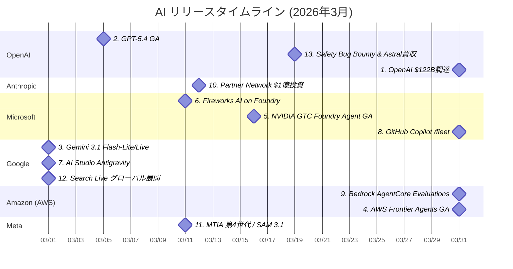

# AI技術動向レポート: 2026年3月

> **対象企業**: OpenAI / Anthropic / Microsoft / Google / Amazon (AWS) / Meta
> **調査期間**: 2026-03-01 〜 2026-03-31
> **生成日**: 2026-04-06
> **対象読者**: クラウド・オンプレ基盤の企画・開発・運用を担当するIT技術者

---

## 目次

- [リリースタイムライン](#リリースタイムライン)
- [注目トピックス](#注目トピックス)
  - [AI活用提案サマリー](#ai活用提案サマリー)

---

## リリースタイムライン

各トピックスのリリース時期を以下に示す。数字はトピックスの番号と対応している。

---

## 注目トピックス

> 13 件のアップデートを注目度順に紹介します。

### AI活用提案サマリー

今月のリリース・アップデートの中で、**クラウド・オンプレ基盤担当のIT技術者**が特に注目すべき活用シナリオをまとめます。

| 優先度 | サービス・機能 | 活用シナリオ | 期待効果 |
| ------ | ------------- | ------------ | -------- |
| ★★★ | OpenAI $122B調達・AI Superapp | OpenAI 長期パートナー戦略・API依存度リスクの再評価 | 調達・技術ロードマップへの影響分析 |
| ★★★ | GPT-5.4 (Microsoft Foundry) | エージェント型ワークフロー（カスタマーサポート、文書作成）への適用 | 長時間タスクの安定実行、人的監視コスト削減 |
| ★★★ | Gemini 3.1 Flash-Lite / Flash Live | リアルタイム応答・大量バッチ処理の低コスト基盤として採用 | レイテンシ削減、大規模デプロイのコスト最適化 |
| ★★★ | AWS Frontier Agents GA | セキュリティ診断・DevOps障害調査の自動化エージェント本番活用 | MTTR 75%削減、根本原因特定精度 94% |
| ★★☆ | Microsoft Foundry Agent Service GA | 社内向けエージェント開発・本番運用基盤の評価・採用検討 | エージェント全ライフサイクルの一元管理 |
| ★★☆ | Fireworks AI on Microsoft Foundry | オープンモデルの高速推論を Azure 上で評価 | 推論速度・コスト最適化 |
| ★★☆ | Google AI Studio Antigravity Agent | プロトタイプアプリ開発・PoC期間の短縮 | アイデアから動作するアプリへの時間短縮 |
| ★★☆ | GitHub Copilot /fleet マルチエージェント | 大規模コードベースのリファクタリング・マイグレーション並列化 | 開発生産性向上、大規模改修の実現 |
| ★★☆ | Bedrock AgentCore Evaluations | Bedrock上の AI エージェントの品質評価・本番前検証の自動化 | エージェント信頼性向上、デプロイリスク低減 |
| ★☆☆ | Anthropic Partner Network | Claude を組み込んだ ISV ソリューションの評価・パイロット | 既存システムへの AI 機能追加コスト削減 |
| ★☆☆ | Meta MTIA / SAM 3.1 | 設備点検・製造ラインでのリアルタイム映像解析の可能性調査 | エッジAIによるコスト削減と自動化 |
| ★☆☆ | Google Search Live & Personal Intelligence | 社内 AI アシスタントの個人コンテキスト活用機能の動向把握 | 生産性向上、業務特化 AI の設計参考 |
| ★☆☆ | OpenAI Safety Bug Bounty & Astral買収 | AI セキュリティ評価・コード品質改善プロセスへの影響把握 | セキュリティ体制の強化参考情報 |

> **凡例**: ★★★ 今すぐ評価推奨 / ★★☆ 近い将来検討 / ★☆☆ 動向ウォッチ推奨

---

### 1. OpenAI、総額1,220億ドルの資金調達を完了

| 項目 | 内容 |
| ---- | ---- |
| 会社 | OpenAI |
| カテゴリ | 注目ニュース |
| リリース日 | 2026年3月31日 |

**ソフトバンクG主導の1,220億ドル調達で「AI Superapp」構想を本格始動**

- OpenAI がソフトバンクGが主導するラウンドで総額1,220億ドル（約18兆円）の資金調達を完了。史上最大規模の単独スタートアップ資金調達。
- 推定企業評価額は3,400億ドル（約51兆円）に達し、AI 業界における圧倒的優位を示す。
- メッセージング・音声・画像生成・コーディング・タスク管理をワンアプリで提供する「AI Superapp」構想を発表。ChatGPT の機能拡張として展開を目指す。
- データセンター・コンピューティングインフラへの大規模投資計画も示され、モデル性能・API 供給能力のさらなる向上が見込まれる。

📘 **用語解説**:
- **AI Superapp**: チャット・音声・画像生成・コーディング等の複数 AI 機能を単一アプリで統合するコンセプト
- **企業評価額（バリュエーション）**: 未公開企業の推定市場価値を指す指標

🔗 **情報源**:
- [OpenAI raises $40 billion in funding round](https://openai.com/index/openai-secures-40-billion-in-funding/)

💡 **AI活用提案**:
- OpenAI への依存度・リスクを改めて評価し、マルチベンダー AI 戦略（Claude・Gemini・オープンモデル）を並行検討してください。調達規模はサービス継続性の担保になる一方、モデル価格・API 仕様の変更リスクも伴います。

---

### 2. GPT-5.4 リリース・Microsoft Foundry で即日 GA

| 項目 | 内容 |
| ---- | ---- |
| 会社 | OpenAI / Microsoft |
| カテゴリ | 新製品リリース |
| リリース日 | 2026年3月5日 |

**GDPval・コンピュータ操作・OSWorld で最高スコアを達成したフラッグシップモデルが Azure 環境で即日利用可能**

- OpenAI が GPT-5.4 をリリース。GDPval（44職種の知識業務ベンチマーク）・コンピュータ操作・OSWorld の3指標で前世代 GPT-5.2 を大幅に上回り、外部評価でも最高スコアを達成。
- Microsoft Azure AI Foundry でリリース当日から GA 提供開始。エンタープライズのデータプライバシー・コンプライアンス・ネットワーク分離を維持したまま利用可能。
- 長時間エージェントタスクの安定性が向上し、複数ツール呼び出し・反復ループのエラー率が大幅に低下。
- GPT-5.2 比でトークン効率が改善され、同一タスクでのコストが下がる傾向がある。

📘 **用語解説**:
- **GDPval**: 44職種の知識業務成果物作成能力を評価するベンチマーク
- **OSWorld**: AI エージェントのデスクトップ PC 操作能力を評価するベンチマーク

🔗 **情報源**:
- [GPT-5.4 が登場](https://openai.com/ja-JP/index/introducing-gpt-5-4/)
- [Introducing GPT-5.4 in Microsoft Foundry](https://techcommunity.microsoft.com/blog/azure-ai-foundry-blog/introducing-gpt-5-4-in-microsoft-foundry/4499785)

💡 **AI活用提案**:
- Azure AI Foundry から GPT-5.4 を試験導入し、既存モデルとの性能・コスト比較を実施してください。エンタープライズ契約のデータ保護条件下で評価でき、エージェント型ワークフローの安定性改善が期待できます。

---

### 3. Gemini 3.1 Flash-Lite / Flash Live リリース

| 項目 | 内容 |
| ---- | ---- |
| 会社 | Google |
| カテゴリ | 新製品リリース |
| リリース日 | 2026年3月1日 |

**低コスト・高速の Flash-Lite と双方向リアルタイム音声映像対話の Flash Live を同時リリース**

- Google が Gemini 3.1 ファミリーとして「Flash-Lite」と「Flash Live」を Google AI Studio・Vertex AI で同日提供開始。
- **Flash-Lite**: Gemini 3.1 Flash より高速・低価格な軽量版。大量バッチ処理・コスト最適化が必要なシステムへの適用に最適。
- **Flash Live**: 双方向リアルタイム音声・映像ストリーミング対話を可能にするモデル。コールセンター自動化・リアルタイム通訳・インタラクティブトレーニングへの応用が期待される。
- どちらも Google AI Studio（無料枠あり）で即日テスト可能。

📘 **用語解説**:
- **Flash-Lite**: 低コスト・高スループット向けに最適化された Gemini の軽量モデルバリアント
- **Flash Live**: リアルタイム双方向音声・映像ストリームを入力として対話できるマルチモーダルモデル

🔗 **情報源**:
- [Google AI updates: March 2026](https://blog.google/technology/ai/google-ai-updates-march-2026/)

💡 **AI活用提案**:
- Flash-Lite を大量ドキュメント処理・分類・サマリー生成のバックエンドモデルとして評価し、プロプライエタリモデルからのコスト削減効果を測定してください。Flash Live はコールセンター AI の PoC 基盤として検討できます。

---

### 4. AWS Frontier Agents が GA — Security・DevOps エージェント

| 項目 | 内容 |
| ---- | ---- |
| 会社 | Amazon (AWS) |
| カテゴリ | 新サービスリリース |
| リリース日 | 2026年3月31日 |

**自律型セキュリティ診断・DevOps障害調査エージェントが本番運用可能な GA として提供開始**

- AWS が「Frontier Agents」シリーズの一般提供（GA）を開始。Security Agent と DevOps Agent の2種が先行リリース。
- **Security Agent**: 自律的なペネトレーションテスト・脆弱性発見を実行。従来数週間かかるセキュリティ診断サイクルを数時間に短縮。
- **DevOps Agent**: マルチクラウド・オンプレ環境の障害を自動調査し根本原因を特定・復旧提案。MTTR を最大 75% 削減、根本原因特定精度 94% を達成（AWS 社内テスト）。
- Amazon Bedrock 上で動作し、既存の AWS セキュリティ・運用ツール（GuardDuty・CloudWatch・Systems Manager 等）と統合可能。

📘 **用語解説**:
- **MTTR（Mean Time To Recover）**: 障害発生から復旧までの平均時間。短いほど運用品質が高い
- **ペネトレーションテスト**: システムの脆弱性を実際に攻撃して発見するセキュリティ診断手法

🔗 **情報源**:
- [AWS Frontier Agents are now generally available](https://aws.amazon.com/blogs/machine-learning/aws-frontier-agents-are-now-generally-available/)

💡 **AI活用提案**:
- Security Agent を既存のペネトレーションテスト契約の補完として評価し、定期診断サイクルの短縮とカバレッジ向上を測定してください。DevOps Agent は SRE チームの障害対応 Runbook を学習させることでオンコール負荷を大幅に削減できます。

---

### 5. Microsoft Foundry Agent Service が NVIDIA GTC で GA

| 項目 | 内容 |
| ---- | ---- |
| 会社 | Microsoft |
| カテゴリ | 新サービスリリース |
| リリース日 | 2026年3月16日 |

**AI エージェントの構築・評価・デプロイ・監視を一元管理するフルライフサイクル基盤が一般提供開始**

- NVIDIA GTC 2026 に合わせて Microsoft が Azure AI Foundry Agent Service の一般提供（GA）を発表。
- エージェントの構築から評価・プロンプト管理・本番デプロイ・監視まで一元的に管理できるプラットフォームとして提供。
- GPT-5.4・Phi-4 をはじめ Foundry で提供される各種モデルとシームレスに統合。
- NVIDIA との協業により GPU accelerated 推論の最適化を強化。エンタープライズ向けの SLA・セキュリティ・コンプライアンス対応も含む。

🔗 **情報源**:
- [NVIDIA GTC: Microsoft renews its commitment to advancing AI infrastructure](https://blogs.microsoft.com/blog/2026/03/16/nvidia-gtc-microsoft-renews-its-commitment-to-advancing-ai-infrastructure/)

💡 **AI活用提案**:
- 社内向け AI エージェントの開発・運用基盤として Azure AI Foundry Agent Service の評価を開始してください。モデル選択・プロンプト管理・本番監視を単一プラットフォームで行えるため、エージェント開発の初期コストを削減できます。

---

### 6. Fireworks AI が Microsoft Foundry に統合

| 項目 | 内容 |
| ---- | ---- |
| 会社 | Microsoft |
| カテゴリ | 新サービスリリース |
| リリース日 | 2026年3月11日 |

**高性能・低レイテンシのオープンモデル推論エンジンが Azure AI Foundry から利用可能に**

- Fireworks AI の高速推論エンジンが Microsoft Azure AI Foundry に統合。
- DeepSeek・Kimi・Mistral・Llama などの主要オープンソースモデルを、エンタープライズグレードのセキュリティ・SLA を持つ Azure 環境で低レイテンシ・高スループットで推論できるようになった。
- クローズドモデルより低コストで大規模推論が可能になり、レイテンシ敏感なリアルタイムアプリケーションでの活用が期待される。
- Azure のデータ主権・ネットワーク分離・コンプライアンス要件を維持したままオープンモデルを活用できる点が特徴。

🔗 **情報源**:
- [Introducing Fireworks AI on Microsoft Foundry](https://azure.microsoft.com/en-us/blog/introducing-fireworks-ai-on-microsoft-foundry-bringing-high-performance-low-latency-open-model-inference-to-azure/)

💡 **AI活用提案**:
- Azure 環境でリアルタイム応答が重要なユースケース（チャット・コード補完・API 連携等）において、Fireworks AI 経由のオープンモデルとプロプライエタリモデルのコスト・レイテンシを比較評価してください。

---

### 7. Google AI Studio に Antigravity Agent 機能が追加

| 項目 | 内容 |
| ---- | ---- |
| 会社 | Google |
| カテゴリ | 機能アップデート |
| リリース日 | 2026年3月1日 |

**自然言語の指示からフルスタック Web アプリをブラウザ内でゼロコードで生成・実行するエージェント機能**

- Google AI Studio に「Antigravity」エージェント機能が追加。
- 自然言語のプロンプトからフルスタック Web アプリケーションを生成し、ブラウザ内でそのまま実行・テスト・デプロイができる。
- CI/CD パイプライン設定なしでプロトタイプを即座にデプロイできるため、PoC・アイデア検証のサイクルタイムが大幅に短縮。
- Gemini 3.1 の長コンテキスト能力を活用して、複雑なアプリ仕様を単一プロンプトから生成可能。

📘 **用語解説**:
- **Antigravity**: Google AI Studio に追加された、自然言語からフルスタックアプリを生成・実行するエージェント機能のコードネーム

🔗 **情報源**:
- [Google AI updates: March 2026](https://blog.google/technology/ai/google-ai-updates-march-2026/)

💡 **AI活用提案**:
- 社内ツール・業務アプリのプロトタイプ作成を AI Studio Antigravity で試し、従来の開発期間と比較してください。PoC 段階での工数削減効果を測定することで、エージェント型開発の ROI を評価できます。

---

### 8. GitHub Copilot が /fleet マルチエージェントコマンドを追加

| 項目 | 内容 |
| ---- | ---- |
| 会社 | Microsoft |
| カテゴリ | 機能アップデート |
| リリース日 | 2026年3月31日 |

**単一コマンドで複数エージェントが大規模コードベースに並列作業するマルチエージェント開発機能**

- GitHub Copilot に `/fleet` コマンドが追加。1つの指示で複数の Copilot エージェントが大規模コードベース上で並列に作業を実行する。
- 大規模リファクタリング・API マイグレーション・レガシーコード現代化などの広範囲な改修作業を短時間で完了できる。
- エージェント間の作業調整・コンフリクト解消は自動で管理され、人間は最終レビューに集中できる。
- GitHub Enterprise 向けに提供開始。大規模な技術的負債の解消プロジェクトへの適用が想定される。

🔗 **情報源**:
- [GitHub Copilot: The agent-powered developer experience](https://github.blog/news-insights/product-news/github-copilot-the-agent-powered-developer-experience/)

💡 **AI活用提案**:
- 長期間塩漬けになっているレガシーコードのモダナイズや、フレームワークバージョンアップ作業に /fleet を試験適用し、人的工数との比較評価を行ってください。大規模改修の実現可能性を再評価できます。

---

### 9. Bedrock AgentCore Evaluations が GA

| 項目 | 内容 |
| ---- | ---- |
| 会社 | Amazon (AWS) |
| カテゴリ | 新サービスリリース |
| リリース日 | 2026年3月31日 |

**Bedrock 上の AI エージェントを本番前に自動評価・検証するマネージドサービスが一般提供開始**

- Amazon Bedrock AgentCore Evaluations が GA。AI エージェントの品質・安全性・精度を本番デプロイ前に体系的に評価する仕組みを提供。
- エージェントの応答品質・ハルシネーション率・ツール呼び出し精度・安全性を自動テストするフレームワーク。
- カスタム評価メトリクスの定義・CI/CD パイプラインへの組み込みをサポート。
- エージェント品質の回帰テスト・モデル更新時の影響評価にも対応。

📘 **用語解説**:
- **ハルシネーション（Hallucination）**: AI モデルが事実に基づかない情報を生成してしまう現象
- **Amazon Bedrock AgentCore**: AWS 上の AI エージェント実行・管理基盤サービス群

🔗 **情報源**:
- [Amazon Bedrock AgentCore is now generally available](https://aws.amazon.com/blogs/machine-learning/amazon-bedrock-agentcore-is-now-generally-available/)

💡 **AI活用提案**:
- Bedrock 上の AI エージェントを本番展開する前に AgentCore Evaluations を CI/CD に組み込み、モデル更新や Prompt 変更時の品質回帰を自動検出する仕組みを構築してください。デプロイリスクを大幅に低減できます。

---

### 10. Anthropic が Claude Partner Network に1億ドル投資

| 項目 | 内容 |
| ---- | ---- |
| 会社 | Anthropic |
| カテゴリ | 注目ニュース |
| リリース日 | 2026年3月12日 |

**大手 SIer 経由の Claude 導入を加速する1億ドルのパートナーエコシステム投資**

- Anthropic が「Claude Partner Network」を正式発表し、2026年は1億ドルを初期投資。
- Accenture・Deloitte・Cognizant・Infosys 等の大手コンサルが参画。パートナー向けトレーニング・技術支援・共同市場開発を提供。
- 最初の技術認定「Claude Certified Architect, Foundations」が開始。大手 SIer 経由での Claude 導入支援体制が整備された。
- Claude はすべての主要クラウド（AWS・Azure・Google Cloud）で利用可能な唯一のフロンティアモデルであることを強調。

🔗 **情報源**:
- [Anthropic invests $100 million into the Claude Partner Network](https://www.anthropic.com/news/claude-partner-network)

💡 **AI活用提案**:
- Claude の企業活用を検討している場合、認定パートナー（大手 SIer 等）経由での導入支援を活用することで PoC から本番移行のリードタイムを短縮できます。パートナーディレクトリで実績ある導入支援企業を確認してください。

---

### 11. Meta が MTIA 第4世代発表 / SAM 3.1 リリース

| 項目 | 内容 |
| ---- | ---- |
| 会社 | Meta |
| カテゴリ | 新製品リリース |
| リリース日 | 2026年3月11日 / 2026年3月27日 |

**自社 AI チップ4世代の2年展開と、映像セグメンテーション最高水準モデル SAM 3.1 を公開**

- **MTIA（Meta Training and Inference Accelerator）第4世代**: 2024〜2026年の2年間で4世代のカスタム AI チップを開発・本番展開。推薦システム・広告配信・生成 AI を数十億ユーザー向けに稼働させるインフラ基盤。
- **SAM 3.1（Segment Anything Model 3.1）**: 映像・画像のリアルタイムセグメンテーションで業界最高水準を達成。製造・医療・自動運転などでの映像解析への応用が期待される。
- 両者をオープンソースとして公開しており、研究・商用利用が可能。

📘 **用語解説**:
- **セグメンテーション**: 画像・映像の各ピクセルがどの物体に属するかを識別する AI 技術
- **MTIA**: Meta が自社 AI ワークロード向けに設計するカスタム AI アクセラレータチップ

🔗 **情報源**:
- [Four MTIA Chips in Two Years: Scaling AI Experiences for Billions](https://ai.meta.com/blog/meta-mtia-scale-ai-chips-for-billions/)
- [SAM 3.1: State-of-the-art video segmentation](https://ai.meta.com/blog/sam-3-1-video-segmentation/)

💡 **AI活用提案**:
- SAM 3.1 を設備点検・製造ラインの不良品検知・工場映像解析の PoC に活用してください。OSS のため初期費用なしで試験でき、エッジ AI 導入の可能性検討に役立ちます。

---

### 12. Google Search Live がグローバル展開 / Personal Intelligence 発表

| 項目 | 内容 |
| ---- | ---- |
| 会社 | Google |
| カテゴリ | 機能アップデート |
| リリース日 | 2026年3月1日 |

**カメラ・マイク・スクリーンを同時入力とするリアルタイム AI 検索が世界展開、個人記憶機能も追加**

- **Google Search Live**: カメラ映像・音声・画面コンテンツを同時入力として AI が回答するリアルタイム検索機能が全世界で展開開始。物理的な環境を見ながらリアルタイムに質問できる。
- **Personal Intelligence**: Gmail・カレンダー・写真・マップ・YouTube 等の個人データを安全に参照し、個人の文脈に合わせた AI アシスタンスを提供する新機能。
- 組み合わせることで「個人の環境と履歴を理解したうえでリアルタイム応答できる AI アシスタント」への進化を示している。

📘 **用語解説**:
- **Personal Intelligence**: Google が提供する、ユーザーの個人データ（メール・カレンダー等）を参照して文脈を理解するパーソナライズド AI 機能

🔗 **情報源**:
- [Google AI updates: March 2026](https://blog.google/technology/ai/google-ai-updates-march-2026/)

💡 **AI活用提案**:
- Search Live の技術アーキテクチャ（マルチモーダルリアルタイム入力）を参考に、社内向けフィールドサービスや現場サポートシステムへの AI 応用設計を検討してください。現場作業員がカメラ越しに AI に質問できるシステムの PoC に応用できます。

---

### 13. OpenAI が Safety Bug Bounty 拡張・Astral を買収

| 項目 | 内容 |
| ---- | ---- |
| 会社 | OpenAI |
| カテゴリ | 注目ニュース |
| リリース日 | 2026年3月19日 |

**AI セキュリティ強化に向けた Bug Bounty プログラムの拡充と、Python ツールチェーン企業 Astral の買収**

- OpenAI が Safety Bug Bounty プログラムを拡張。AI モデルの安全性評価・脆弱性報告の報奨金制度を強化し、外部セキュリティ研究コミュニティとの協力体制を深化。
- Astral（Python リンター「Ruff」・パッケージマネージャ「uv」の開発元）を買収。Python エコシステムのコード品質向上ツールを OpenAI プラットフォームに統合する狙い。
- `uv` と `Ruff` は Python 開発者の間で急速に普及しており、OpenAI の開発者ツール戦略の強化と解釈できる。

📘 **用語解説**:
- **Ruff**: Rust で書かれた超高速 Python リンター・フォーマッター（Astral 開発）
- **uv**: Rust で書かれた高速 Python パッケージ・プロジェクトマネージャ（Astral 開発）
- **Bug Bounty**: セキュリティ脆弱性を発見・報告した外部研究者に報奨金を支払うプログラム

🔗 **情報源**:
- [OpenAI acquires Astral](https://openai.com/index/openai-acquires-astral/)

💡 **AI活用提案**:
- Python で AI アプリケーションを開発しているチームは、`uv` と `Ruff` を CI/CD パイプラインに今すぐ導入してください。OpenAI 傘下となったことで長期サポートの信頼性が向上し、標準ツールとしての採用リスクが下がりました。

---
