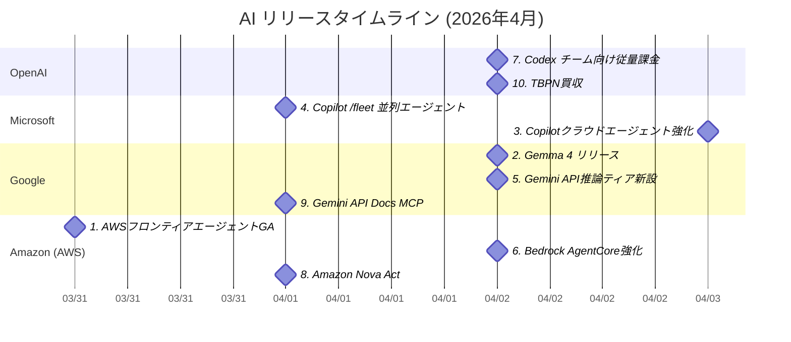

# AI技術動向レポート: 2026年4月

> **対象企業**: OpenAI / Anthropic / Microsoft / Google / Amazon (AWS) / Meta
> **調査期間**: 2026-04-01 〜 2026-04-30
> **生成日**: 2026年4月6日
> **対象読者**: クラウド・オンプレ基盤の企画・開発・運用を担当するIT技術者

---

## 目次

- [リリースタイムライン](#リリースタイムライン)
- [注目トピックス](#注目トピックス)
  - [AI活用提案サマリー](#ai活用提案サマリー)

---

## リリースタイムライン

各トピックスのリリース時期を以下に示す。数字はトピックスの番号と対応している。

---

## 注目トピックス

> 10件のアップデートを注目度順に紹介します。

### AI活用提案サマリー

今月のリリース・アップデートの中で、**クラウド・オンプレ基盤担当のIT技術者**が特に注目すべき活用シナリオをまとめます。

| 優先度 | サービス・機能 | 活用シナリオ | 期待効果 |
| ------ | ------------- | ------------ | -------- |
| ★★★ | AWS Security Agent / DevOps Agent | ペネトレーションテストの自動化・インシデント対応をAIエージェントに委譲し、既存のDevOpsワークフローに組み込む | テスト期間を数週間→数時間に短縮、MTTR 75%削減 |
| ★★★ | Gemma 4（Google） | 規制・機密データを扱う業務にApache 2.0オープンモデルをオンプレ・VPC内にデプロイし、データ外部送信ゼロで推論基盤を構築 | クラウドAPI依存の排除とコスト最適化、データ主権の確保 |
| ★★★ | GitHub Copilot クラウドエージェント | コミット署名・ランナー制御・ファイアウォール設定を活用し、エンタープライズ要件を満たすAIコーディング環境を整備 | コード変更の追跡可能性向上とセキュリティ強化 |
| ★★☆ | GitHub Copilot /fleet | CI/CDや大規模リファクタリング時に複数エージェントを並列起動し、複数コンポーネントを同時変更 | エンジニアリング作業の並列化による高速化 |
| ★★☆ | Gemini API Flex / Priority推論 | バックエンドAI処理にFlex（50%割引）、ユーザー向けリアルタイム機能にPriorityを使い分けてコスト最適化 | Gemini API利用コストを最大50%削減 |
| ★★☆ | Amazon Bedrock AgentCore | ドメインホワイトリスト・セッション状態管理を組み合わせ、安全で再現性の高いAIエージェントを本番環境に構築 | エンタープライズ対応AIエージェント基盤の確立 |
| ★★☆ | OpenAI Codex 従量課金 | 固定費なしのトークン課金で小規模チームからCodexを試験導入し、POCで効果測定後に全社展開を判断 | 初期投資低減・ROI計測の容易化 |
| ★☆☆ | Amazon Nova Act | 価格監視・Webフォーム入力などの繰り返しブラウザ操作をAIエージェントで自動化 | 手作業モニタリングの工数を大幅削減 |
| ★☆☆ | Gemini API Docs MCP | 社内のGemini API活用プロジェクトにMCPサーバーを接続し、AIコーディングエージェントの正確性を向上 | Gemini API利用時の誤ったコード生成を低減 |
| ★☆☆ | OpenAI TBPN買収 | OpenAIのAIコミュニケーション戦略変化を一次情報として把握し、AI政策・規制の動向ウォッチに活用 | AI業界動向の迅速な把握 |

> **凡例**: ★★★ 今すぐ評価推奨 / ★★☆ 近い将来検討 / ★☆☆ 動向ウォッチ推奨

---

### 1. AWS フロンティアエージェント GA（Security Agent / DevOps Agent）

| 項目 | 内容 |
| ---- | ---- |
| 会社 | Amazon (AWS) |
| カテゴリ | 新サービスリリース |
| リリース日 | 2026年3月31日 |

**自律型AIエージェントがセキュリティテストとDevOps運用を担い、本番提供を開始**

- **AWS Security Agent**: ソースコード・アーキテクチャ図・ドキュメントを取り込み、自律的にペネトレーションテストを実施。テスト期間を数週間→数時間に圧縮（90%以上短縮）し、従来スキャナーが見逃す複合的な攻撃チェーンも検出
- **AWS DevOps Agent**: CloudWatch・Datadog・Splunk等の監視ツールやGitHub/GitLabと統合し、マルチクラウド・オンプレ環境でインシデント根本原因を自律調査。MTTR 75%低下・根本原因特定精度 94%をプレビュー中に報告
- どちらも「フロンティアエージェント」と位置付けられ、数時間〜数日単位で自律継続実行する点が従来のAIアシスタントとの最大差異

📘 **用語解説**:
- **MTTR**: Mean Time To Recover（平均復旧時間）—障害発生から復旧完了までの平均時間
- **ペネトレーションテスト**: 疑似攻撃でシステムの脆弱性を発見・検証するセキュリティ評価作業

🔗 **情報源**:
- [AWS launches frontier agents for security testing and cloud operations](https://aws.amazon.com/blogs/machine-learning/aws-launches-frontier-agents-for-security-testing-and-cloud-operations/)

💡 **AI活用提案**:
- AWS Security Agentをシフトレフト戦略に組み込み、開発ブランチごとの自動ペネトレーションテストパイプラインを構築することを検討してみてください
- AWS DevOps Agentをオンコール対応の一次調査ツールとして試験導入し、アラート発生時の自動根本原因調査フローを実装することで深夜対応コストを削減できます

---

### 2. Gemma 4 リリース（Apache 2.0 オープンモデルファミリー）

| 項目 | 内容 |
| ---- | ---- |
| 会社 | Google |
| カテゴリ | 新製品リリース |
| リリース日 | 2026年4月2日 |

**Googleがビジネス利用可能なApache 2.0ライセンスのオープンモデルファミリーを刷新**

- E2B・E4B（エッジ向け）・26B MoE・31B Dense の4サイズを展開。31B DenseはArena.aiのオープンモデルランキングで世界3位、26B MoEは6位と、モデルサイズの20倍以上の規模の競合を上回る
- 推論・エージェントワークフロー・コード生成・ビジョン&オーディオをネイティブサポート。128K〜256K コンテキストウィンドウで長文一括処理に対応
- vLLM・llama.cpp・Ollama・NVIDIA NIM など主要ML実行環境に初日対応。Vertex AI・GKE・Cloud Runでもクラウドスケールでの提供が即日開始

📘 **用語解説**:
- **MoE (Mixture of Experts)**: 入力ごとに一部のエキスパートパラメータのみ活性化するアーキテクチャ。26B MoEは実推論時に約3.8Bパラメータのみ使用し、高速かつ省コスト

🔗 **情報源**:
- [Gemma 4: Byte for byte, the most capable open models](https://blog.google/innovation-and-ai/technology/developers-tools/gemma-4/)

💡 **AI活用提案**:
- データを社外に送信できない規制業界や機密情報を扱うユースケースに Gemma 4 をオンプレまたはVPC内でホストし、クラウドAPIに依存しない推論基盤を構築することを検討してみてください
- E2B/E4B モデルをエッジサーバーやIoTゲートウェイに搭載し、ネットワーク切断時でも動作するリアルタイム推論環境のパイロットを検討してみてください

---

### 3. GitHub Copilot クラウドエージェント強化（署名・ランナー制御・ファイアウォール）

| 項目 | 内容 |
| ---- | ---- |
| 会社 | Microsoft |
| カテゴリ | 機能アップデート |
| リリース日 | 2026年4月3日 |

**Copilot クラウドエージェントにエンタープライズ向けセキュリティ・ガバナンス機能を追加**

- **コミット署名**: Copilot クラウドエージェントが生成したコミットに自動で暗号署名が付与され、コード変更の真正性と追跡可能性を担保
- **ランナー制御**: 組織管理者が Copilot クラウドエージェントの実行ランナーを組織単位で指定・制限可能に。自社管理のプライベートランナーへの固定も実現
- **ファイアウォール設定**: ネットワークレベルでエージェントのアクセス先を制限する組織ファイアウォール設定を追加。意図しない外部通信を防御し、コンプライアンス要件への対応を強化

🔗 **情報源**:
- [Organization runner controls for Copilot cloud agent](https://github.blog/changelog/2026-04-03-organization-runner-controls-for-copilot-cloud-agent)
- [Organization firewall settings for Copilot cloud agent](https://github.blog/changelog/2026-04-03-organization-firewall-settings-for-copilot-cloud-agent)
- [Copilot cloud agent signs its commits](https://github.blog/changelog/2026-04-03-copilot-cloud-agent-signs-its-commits)

💡 **AI活用提案**:
- ファイアウォール設定とプライベートランナーを組み合わせて GitHub Copilot Enterprise をクローズドネットワーク内に閉じ込め、金融・医療・公共セクターのコンプライアンス要件を満たすAIコーディング環境を整備することを検討してみてください

---

### 4. GitHub Copilot CLI /fleet（複数エージェント並列実行）

| 項目 | 内容 |
| ---- | ---- |
| 会社 | Microsoft |
| カテゴリ | 機能アップデート |
| リリース日 | 2026年4月1日 |

**Copilot CLI が `/fleet` コマンドで複数 AI エージェントを並列ディスパッチできるように**

- `/fleet` コマンド1つで複数の Copilot エージェントを並列起動し、ファイルをまたいだ大規模タスクを分割処理
- プロンプト内で依存関係を宣言することでエージェント間の処理順序を制御。競合状態を回避しながら並列化可能
- 大規模リファクタリング・複数マイクロサービスの同時テスト修正・ライブラリ依存更新などのシナリオで特に有効

🔗 **情報源**:
- [Run multiple agents at once with /fleet in Copilot CLI](https://github.blog/ai-and-ml/github-copilot/run-multiple-agents-at-once-with-fleet-in-copilot-cli/)

💡 **AI活用提案**:
- マイクロサービスのリファクタリングや依存ライブラリのメジャーバージョンアップ時に `/fleet` を活用し、複数サービスへの変更を並列適用することで作業日数を大幅に短縮することを検討してみてください

---

### 5. Gemini API Flex・Priority 推論ティア追加

| 項目 | 内容 |
| ---- | ---- |
| 会社 | Google |
| カテゴリ | 機能アップデート |
| リリース日 | 2026年4月2日 |

**Gemini API にコスト最適化 Flex と高信頼性 Priority の2推論ティアが追加**

- **Flex Inference**: 標準料金の50%オフ。非同期Job管理が不要な同期エンドポイントで、遅延許容ワークロード（バックグラウンドCRM更新・大規模研究シミュレーション・エージェントの「思考」プロセス等）向け
- **Priority Inference**: 最高信頼性のプレミアムティア。ピーク負荷時も優先処理され、上限超過時は標準ティアに自動フォールバックしてアプリの可用性を維持
- どちらも `service_tier` パラメータ1つで切替可能。複雑な非同期アーキテクチャを組まずに用途別コスト管理を実現

📘 **用語解説**:
- **SNI (Server Name Indication)**: TLS接続時に接続先ドメイン名を事前通知する拡張。Priority推論のトラフィック優先制御に利用される仕組みと類似の概念

🔗 **情報源**:
- [New ways to balance cost and reliability in the Gemini API](https://blog.google/innovation-and-ai/technology/developers-tools/introducing-flex-and-priority-inference/)

💡 **AI活用提案**:
- 夜間バッチのログ分析・テキスト変換などの遅延許容タスクに Flex Inference を適用し、Gemini API コストを最大50%削減する試算を行ってみてください
- ユーザー向けリアルタイムチャットや本番監視アラートのAI処理には Priority Inference を適用し、SLA 要件を満たす推論アーキテクチャを設計することを検討してみてください

---

### 6. Amazon Bedrock AgentCore 新機能（ドメイン制御・セッション状態管理）

| 項目 | 内容 |
| ---- | ---- |
| 会社 | Amazon (AWS) |
| カテゴリ | 機能アップデート |
| リリース日 | 2026年4月2日 |

**Bedrock AgentCore に AIエージェントの安全な本番運用を支援する複数機能が追加**

- **ドメインアクセス制御**: AWS Network FirewallとSNI検査を組み合わせ、AIエージェントがアクセス可能なWebドメインをホワイトリストで制限。エージェントからの意図しない外部通信を防御
- **セッション状態の永続化**: マネージドセッションストレージでエージェントのファイルシステム状態を保持。シェルコマンド実行もサポートし、長時間・複数ステップのエージェントタスクを安定運用
- **AgentCore Evaluations**: 開発〜本番のライフサイクル全体でエージェントの性能を多面的に評価するフルマネージドサービスを提供開始

📘 **用語解説**:
- **SNI (Server Name Indication)**: TLSハンドシェイク時にクライアントが宛先ドメインを通知する拡張機能。これを利用してネットワークレベルのドメインフィルタリングが可能

🔗 **情報源**:
- [Control which domains your AI agents can access](https://aws.amazon.com/blogs/machine-learning/control-which-domains-your-ai-agents-can-access/)
- [Persist session state with filesystem configuration and execute shell commands](https://aws.amazon.com/blogs/machine-learning/persist-session-state-with-filesystem-configuration-and-execute-shell-commands/)

💡 **AI活用提案**:
- ドメインホワイトリスト機能を活用し、Bedrock AIエージェントが社内承認済みAPIエンドポイントにのみアクセスできるポリシーを実装し、情報漏えいリスクを低減することを検討してみてください
- AgentCore Evaluations をCI/CDパイプラインに組み込んでエージェントのリリース前品質ゲートを設け、本番障害のリスクを軽減することを検討してみてください

---

### 7. OpenAI Codex チーム向け従量課金制

| 項目 | 内容 |
| ---- | ---- |
| 会社 | OpenAI |
| カテゴリ | 機能アップデート |
| リリース日 | 2026年4月2日 |

**Codex が ChatGPT Business/Enterprise に「Codex のみシート」として従量課金で登場**

- 固定シート費なしのトークン消費ベース課金で、レートリミットなし。小規模チームが固定契約なしにPOCを実施できる
- ChatGPT Business の年間価格も$25→$20/シートに値下げ。新規 Codex シート追加で期間限定の$100クレジット（最大$500/チーム）の特典も提供
- Plugins（外部サービス連携）および Automations（スケジュール実行）機能が利用可能になり、定型的なコーディングワークフローの自動化を強化

🔗 **情報源**:
- [Codex now offers pay-as-you-go pricing for teams](https://openai.com/index/codex-flexible-pricing-for-teams/)

💡 **AI活用提案**:
- 少人数チームに Codex のみシートで試験導入し、プルリクエスト対応・テスト生成・ドキュメント更新の所要時間を計測した上で全社展開の費用対効果を検討してみてください

---

### 8. Amazon Nova Act（AI ブラウザ自動化 SDK）

| 項目 | 内容 |
| ---- | ---- |
| 会社 | Amazon (AWS) |
| カテゴリ | 新製品リリース |
| リリース日 | 2026年4月1日 |

**AWS が自然言語でブラウザを操作するAIエージェント向けオープンソース SDK を提供開始**

- 自然言語の指示でブラウザを操作する Python SDK。`act()` / `act_get()` APIで構造化データ抽出が可能
- `ThreadPoolExecutor` による複数ブラウザセッションの並列実行をサポートし、大規模Web監視にスケール可能
- VS Code・Cursor・Kiro 向け IDE 拡張を同時提供。AgentCore Browser Tool（ACBT）と統合して本番環境にデプロイし、AWSコンソールからワークフローを可視化・監視可能

🔗 **情報源**:
- [Automating competitive price intelligence with Amazon Nova Act](https://aws.amazon.com/blogs/machine-learning/automating-competitive-price-intelligence-with-amazon-nova-act/)

💡 **AI活用提案**:
- 自社サービスの競合価格モニタリング・Webフォーム入力の自動化・レガシーWebアプリのE2Eテスト自動化など、繰り返しブラウザ操作業務の自動化PoC に Nova Act を試験導入してみてください

---

### 9. Gemini API Docs MCP と Agent Skills

| 項目 | 内容 |
| ---- | ---- |
| 会社 | Google |
| カテゴリ | 新製品リリース |
| リリース日 | 2026年4月1日 |

**Gemini API の最新ドキュメントをコーディングエージェントにリアルタイム提供するツール群が公開**

- **Gemini API Docs MCP** (`gemini-api-docs-mcp.dev`): MCPを通じてコーディングエージェントに常に最新のGemini APIドキュメント・SDK情報・モデル情報を提供し、学習データ古さ起因の誤った実装を防止
- **Gemini API Developer Skills**: ベストプラクティス指示・リソースリンク・最新SDKパターンをエージェントに注入し、正確なコード生成を促進
- 両ツール併用時に評価正解率96.3%・1正解あたりのトークン消費63%削減を達成（単純プロンプティング比）

📘 **用語解説**:
- **MCP (Model Context Protocol)**: AIエージェントが外部ドキュメント・ツール・APIと標準的に接続するためのプロトコル仕様

🔗 **情報源**:
- [Improve coding agents' performance with Gemini API Docs MCP and Agent Skills](https://blog.google/innovation-and-ai/technology/developers-tools/gemini-api-docsmcp-agent-skills/)

💡 **AI活用提案**:
- Gemini API を組み込んだ社内開発プロジェクトに Gemini API Docs MCP を追加し、AIコーディングアシスタントが生成するコードの正確性向上と API 誤用由来のバグ削減を図ることを検討してみてください

---

### 10. OpenAI、TBPN を買収

| 項目 | 内容 |
| ---- | ---- |
| 会社 | OpenAI |
| カテゴリ | 注目ニュース |
| リリース日 | 2026年4月2日 |

**OpenAI がテック専門メディア「TBPN」を戦略部門に組み込み、AI普及コミュニケーションを強化**

- TBPN（Technology Business Programming Network）は平日11〜14時（PT）に配信される日次ライブテックトーク番組。NYTimesが「シリコンバレーの最新の熱狂」と評した急成長メディア
- 編集独立性を明示的に契約で保護した上での買収。ゲスト選定・番組制作は引き続きTBPN主導で実施
- OpenAIの Strategy 部門傘下に入り、AIの社会的理解促進と対外コミュニケーション戦略のイノベーションを担う

🔗 **情報源**:
- [OpenAI acquires TBPN](https://openai.com/index/openai-acquires-tbpn/)

💡 **AI活用提案**:
- OpenAI のコミュニケーション戦略の変化を動向ウォッチすることで、AI政策・規制・社会受容性に関する一次情報を早期にキャッチし、自社のAI導入計画の見直しや経営層への情報提供に活用することを検討してみてください

---

## 収集できなかった情報源・補足

| 会社 | 情報源 | 状況 |
| ---- | ------ | ---- |
| Anthropic | anthropic.com/news | 調査時点（2026年4月6日）で4月の新規アップデートは確認されず。最新は2026年3月31日のオーストラリア政府とのMOU締結 |
| Meta | ai.meta.com/blog | 調査時点（2026年4月6日）で4月の新規アップデートは確認されず。最新は2026年3月27日の SAM 3.1 発表 |
| Amazon (AWS) | aws.amazon.com/bedrock/whats-new | HTTP 404 エラーにより取得失敗。AWS Machine Learning Blog から代替情報を収集 |

> 本レポートは2026年4月6日時点の情報に基づいています。4月中に追加の発表が見込まれるため、月末に再確認することを推奨します。
