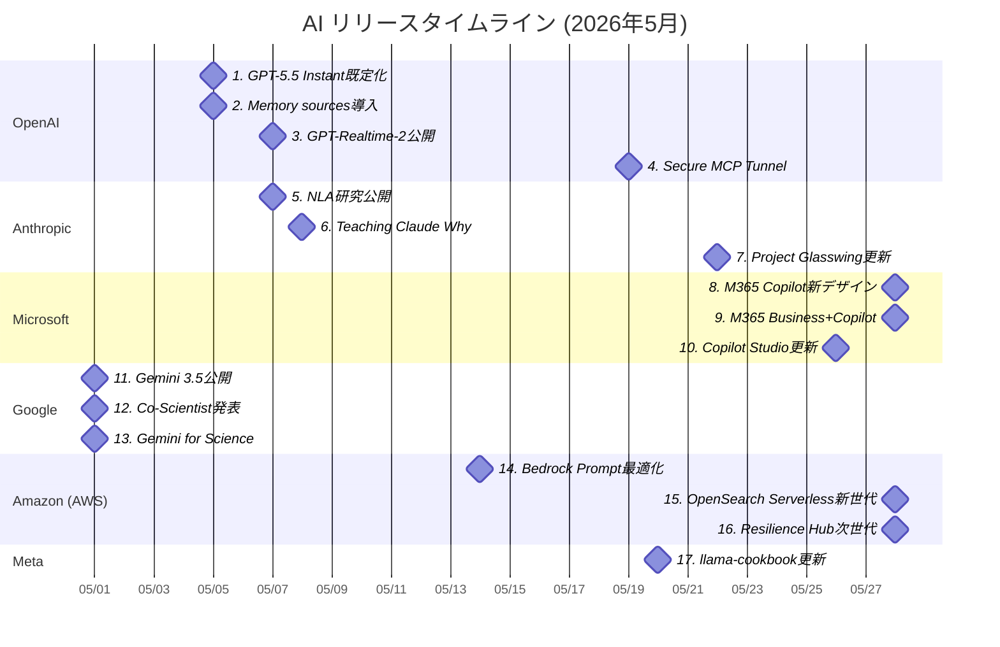

# AI技術動向レポート: 2026年5月

> **対象企業**: OpenAI / Anthropic / Microsoft / Google / Amazon (AWS) / Meta
> **調査期間**: 2026-05-01 〜 2026-05-31
> **生成日**: 2026-07-05
> **対象読者**: クラウド・オンプレ基盤の企画・開発・運用を担当するIT技術者

---

## 目次

- [リリースタイムライン](#リリースタイムライン)
- [注目トピックス](#注目トピックス)
  - [AI活用提案サマリー](#ai活用提案サマリー)

---

## リリースタイムライン

各トピックスのリリース時期を以下に示す。数字はトピックスの番号と対応している。

---

## 注目トピックス

> 17 件のアップデートを注目度順に紹介します。

### AI活用提案サマリー

今月のリリース・アップデートの中で、**クラウド・オンプレ基盤担当のIT技術者**が特に注目すべき活用シナリオをまとめます。

| 優先度 | サービス・機能 | 活用シナリオ | 期待効果 |
| ------ | ------------- | ------------ | -------- |
| ★★★ | GPT-Realtime-2 / Realtime翻訳 | 音声エージェント基盤の刷新PoC | 低遅延化と多言語対応の拡張 |
| ★★★ | Secure MCP Tunnel | 社内MCPサーバーの閉域接続 | セキュリティと接続性の両立 |
| ★★★ | Copilot Studio（computer-using agents GA） | API未整備業務のUI自動化 | 手作業削減と運用標準化 |
| ★★☆ | Amazon Bedrock Prompt最適化 | モデル移行時のプロンプト最適化運用 | 精度維持と移行時間短縮 |
| ★★☆ | OpenSearch Serverless新世代 | エージェント向け検索基盤の再設計 | スケール性能とコスト効率改善 |
| ★★☆ | Gemini 3.5 / Co-Scientist | 研究・技術調査ワークフロー支援 | 調査速度と仮説探索力向上 |
| ★★☆ | M365 Copilot新デザイン / Business SKU | M365中心業務へのAI導入加速 | 利用定着と生産性向上 |
| ★☆☆ | Anthropic研究（NLA / Teaching Claude Why） | モデル可観測性・整合性の技術検証 | 安全設計の知見獲得 |
| ★☆☆ | Meta Llama Cookbook更新 | OSS実装例の追随検証 | 開発パターンの学習効率化 |

> **凡例**: ★★★ 今すぐ評価推奨 / ★★☆ 近い将来検討 / ★☆☆ 動向ウォッチ推奨

---

### 1. GPT-5.5 Instant が ChatGPT 既定モデルとして展開

| 項目 | 内容 |
| ---- | ---- |
| 会社 | OpenAI |
| カテゴリ | 機能アップデート |
| リリース日 | 2026年5月5日 |

**既定モデル更新により、日常的な業務利用の応答品質・簡潔性の改善が期待される。**

- GPT-5.5 Instant が ChatGPT のデフォルトとして展開された。
- 精度、簡潔性、画像理解、Web検索時の回答品質改善が示された。
- 既存運用では再学習なしで体感品質が上がる可能性が高い。

🔗 **情報源**:
- [ChatGPT — Release Notes](https://help.openai.com/en/articles/6825453-chatgpt-release-notes)

💡 **AI活用提案**:
- 社内ヘルプデスクや要約支援の既存プロンプトを再評価し、回答品質向上を定量化してみてください。

---

### 2. Memory sources によるパーソナライズ根拠表示

| 項目 | 内容 |
| ---- | ---- |
| 会社 | OpenAI |
| カテゴリ | 機能アップデート |
| リリース日 | 2026年5月5日 |

**記憶参照の可視化により、個別最適化と説明可能性を両立しやすくなった。**

- Memory sources が導入され、どの情報が応答に寄与したか確認可能になった。
- 記憶や過去会話の編集・削除導線が強化された。
- パーソナライズ運用でのガバナンス設計に有効。

🔗 **情報源**:
- [ChatGPT — Release Notes](https://help.openai.com/en/articles/6825453-chatgpt-release-notes)

💡 **AI活用提案**:
- 個人化機能を使う業務で、記憶利用ポリシーと監査手順を先に定義して運用してみてください。

---

### 3. GPT-Realtime-2 / Translate / Whisper 公開

| 項目 | 内容 |
| ---- | ---- |
| 会社 | OpenAI |
| カテゴリ | 新製品リリース |
| リリース日 | 2026年5月7日 |

**リアルタイム音声スタック刷新で、音声エージェント実装の選択肢が拡大。**

- GPT-Realtime-2、Realtime-Translate、Realtime-Whisper が公開された。
- 音声対話、同時翻訳、ストリーミング文字起こしをAPIレベルで分離して利用可能。
- コールセンターや現場支援アプリの設計自由度が高まる。

📘 **用語解説**:
- **Realtime API**: 低遅延の双方向ストリーミング対話向けAPI。

🔗 **情報源**:
- [OpenAI Changelog (May 2026)](https://developers.openai.com/api/docs/changelog)

💡 **AI活用提案**:
- まずは1ユースケースに絞って音声往復遅延と誤認識率を測定し、既存基盤との比較検証を進めてみてください。

---

### 4. Secure MCP Tunnel 公開

| 項目 | 内容 |
| ---- | ---- |
| 会社 | OpenAI |
| カテゴリ | 新サービスリリース |
| リリース日 | 2026年5月19日 |

**オンプレ・閉域MCP連携を公開ネットワーク露出なしで実現する手段が提供。**

- Secure MCP Tunnel がエンタープライズ向けに公開された。
- ChatGPTやResponses APIなどから私設MCPサーバーへ安全接続できる。
- 公開エンドポイント不要で導入可能なため、社内統制に適合しやすい。

📘 **用語解説**:
- **MCP**: モデルと外部ツールを接続するための共通プロトコル。

🔗 **情報源**:
- [OpenAI Changelog (May 2026)](https://developers.openai.com/api/docs/changelog)

💡 **AI活用提案**:
- まずは読み取り専用ツールからトンネル接続し、監査ログ要件を満たせるか検証してみてください。

---

### 5. Natural Language Autoencoders 研究公開

| 項目 | 内容 |
| ---- | ---- |
| 会社 | Anthropic |
| カテゴリ | 注目ニュース |
| リリース日 | 2026年5月7日 |

**モデル内部表現を自然言語へ写像する研究が進み、可観測性向上の可能性を示した。**

- Claude の内部思考を人が読める形へ変換する研究が公開された。
- 解釈可能性の向上は安全性評価や不具合調査に有効。
- 実運用ではモデル挙動理解の補助として期待される。

🔗 **情報源**:
- [Natural Language Autoencoders](https://www.anthropic.com/research/natural-language-autoencoders)

💡 **AI活用提案**:
- 本番導入モデルの評価項目に「説明可能性」を追加し、監査観点での比較を試してみてください。

---

### 6. Teaching Claude Why 研究公開

| 項目 | 内容 |
| ---- | ---- |
| 会社 | Anthropic |
| カテゴリ | 注目ニュース |
| リリース日 | 2026年5月8日 |

**エージェント的不整合を低減するアプローチが示され、安全運用の研究が前進。**

- agentic misalignment 低減に関する研究成果が公開された。
- 高自律タスクでの逸脱抑制に関する示唆を提供。
- 企業利用ではガードレール設計と併用が前提となる。

🔗 **情報源**:
- [Teaching Claude why](https://www.anthropic.com/research/teaching-claude-why)

💡 **AI活用提案**:
- 高権限アクションを伴うエージェントで、人手承認ポイントを再点検してみてください。

---

### 7. Project Glasswing 初期アップデート

| 項目 | 内容 |
| ---- | ---- |
| 会社 | Anthropic |
| カテゴリ | 注目ニュース |
| リリース日 | 2026年5月22日 |

**Glasswing の初期アップデートが公開され、安全・運用設計の継続的強化方針を提示。**

- Project Glasswing の初期更新が公開された。
- 研究・運用双方での段階的改善アプローチが示された。
- 複数ベンダー連携時の安全設計検討に参考になる。

🔗 **情報源**:
- [Project Glasswing: An initial update](https://www.anthropic.com/research/glasswing-initial-update)

💡 **AI活用提案**:
- 自社PoCでも、初期リリース後の安全改善サイクルを前提に評価計画を組んでみてください。

---

### 8. Microsoft 365 Copilot 新デザイン発表

| 項目 | 内容 |
| ---- | ---- |
| 会社 | Microsoft |
| カテゴリ | 機能アップデート |
| リリース日 | 2026年5月28日 |

**Copilotの導線刷新により、日常業務への埋め込み利用がしやすくなった。**

- Microsoft 365 Copilot の新デザインが発表された。
- クリーンで高速、作業フローに沿うUIを強調。
- 現場導入時の学習コスト低減が期待される。

🔗 **情報源**:
- [Introducing a new design for Microsoft 365 Copilot](https://www.microsoft.com/en-us/microsoft-365/blog/2026/05/28/introducing-a-new-design-for-microsoft-365-copilot/)

💡 **AI活用提案**:
- 業務部門ごとに利用シナリオを定義し、UI刷新後の利用率変化を測定してみてください。

---

### 9. Microsoft 365 Business with Copilot 発表

| 項目 | 内容 |
| ---- | ---- |
| 会社 | Microsoft |
| カテゴリ | 新サービスリリース |
| リリース日 | 2026年5月28日 |

**中小企業向けSKUにCopilot内蔵方針が示され、標準業務へのAI実装が進展。**

- Copilot内蔵の新しい Microsoft 365 Business SKU が案内された。
- 小規模組織でも導入しやすいパッケージ化が進む。
- ライセンスと運用設計を一体で見直す契機となる。

🔗 **情報源**:
- [Introducing Microsoft 365 Business with Copilot](https://www.microsoft.com/en-us/microsoft-365/blog/2026/05/28/introducing-microsoft-365-business-with-copilot-the-new-standard-for-small-business/)

💡 **AI活用提案**:
- ライセンス計画と合わせて、部門ごとのCopilot利用ガイドラインを先行整備してみてください。

---

### 10. Copilot Studio 5月更新（computer-using agents GA）

| 項目 | 内容 |
| ---- | ---- |
| 会社 | Microsoft |
| カテゴリ | 機能アップデート |
| リリース日 | 2026年5月26日 |

**UI操作型エージェントのGAにより、API未整備システム自動化の実行性が向上。**

- computer-using agents が GA として案内された。
- Work IQ連携やワークフロー統合、リアルタイム音声体験の拡張も提示。
- レガシー業務の自動化適用範囲を広げやすい。

📘 **用語解説**:
- **computer-using agents**: UI操作を通じてタスクを実行するエージェント機能。

🔗 **情報源**:
- [New and improved: Computer-using agents...](https://www.microsoft.com/en-us/microsoft-copilot/blog/copilot-studio/new-and-improved-computer-using-agents-a-new-workflows-experience-and-real-time-voice-experiences/)

💡 **AI活用提案**:
- API非対応の社内システムを対象に、小さな業務単位からUI自動化の安定性を検証してみてください。

---

### 11. Gemini 3.5: frontier intelligence with action

| 項目 | 内容 |
| ---- | ---- |
| 会社 | Google |
| カテゴリ | 新製品リリース |
| リリース日 | 2026年5月 |

**Gemini 3.5 系列の発表により、行動実行を含むモデル活用が前進。**

- DeepMind News で Gemini 3.5 の公開が示された。
- 「with action」の方向性が明示され、エージェント設計との親和性が高い。
- 実装面では評価軸の再定義が必要になる。

🔗 **情報源**:
- [Gemini 3.5: frontier intelligence with action](https://blog.google/innovation-and-ai/models-and-research/gemini-models/gemini-3-5/)

💡 **AI活用提案**:
- エージェント要件に合わせて、推論精度だけでなくツール実行成功率も評価項目へ追加してみてください。

---

### 12. Co-Scientist: multi-agent AI partner 発表

| 項目 | 内容 |
| ---- | ---- |
| 会社 | Google |
| カテゴリ | 注目ニュース |
| リリース日 | 2026年5月 |

**研究支援向けのマルチエージェント構想が示され、科学技術領域の活用像が具体化。**

- Co-Scientist が研究加速のためのAIパートナーとして紹介された。
- 複数エージェント連携による仮説探索の効率化が主眼。
- 企業R&Dの探索業務にも応用余地がある。

🔗 **情報源**:
- [Co-Scientist: A multi-agent AI partner to accelerate research](https://deepmind.google/blog/co-scientist-a-multi-agent-ai-partner-to-accelerate-research/)

💡 **AI活用提案**:
- 技術調査プロセスを分解し、文献探索・比較・要約を役割分担したマルチエージェント構成を試してみてください。

---

### 13. Gemini for Science 発表

| 項目 | 内容 |
| ---- | ---- |
| 会社 | Google |
| カテゴリ | 注目ニュース |
| リリース日 | 2026年5月 |

**科学向けAI実験・ツール群が提示され、研究現場向け応用の加速が期待される。**

- Gemini for Science がI/O文脈で案内された。
- 科学研究向けの実験・ツール活用が前面に出された。
- 実データ利用時は評価再現性とガバナンス整備が重要となる。

🔗 **情報源**:
- [Gemini for Science: AI experiments and tools for a new era of discovery](https://blog.google/innovation-and-ai/technology/research/gemini-for-science-io-2026/)

💡 **AI活用提案**:
- 研究開発部門で、データ持ち出し制約を満たす検証環境を用意した上で限定導入を検討してみてください。

---

### 14. Amazon Bedrock 高度プロンプト最適化・移行ツール

| 項目 | 内容 |
| ---- | ---- |
| 会社 | Amazon (AWS) |
| カテゴリ | 機能アップデート |
| リリース日 | 2026年5月14日 |

**モデル移行時のプロンプト最適化を支援する機能が追加され、移行負荷を低減。**

- Bedrock に advanced prompt optimization と migration tool が導入された。
- 最大5モデル同時比較と評価フィードバックループが示された。
- モデル変更時の品質劣化リスクを抑えやすい。

🔗 **情報源**:
- [Amazon Bedrock introduces new advanced prompt optimization and migration tool](https://aws.amazon.com/blogs/aws/amazon-bedrock-introduces-new-advanced-prompt-optimization-and-migration-tool/)

💡 **AI活用提案**:
- モデル更新前に主要プロンプトをバッチ評価し、移行判定を自動化する運用を検討してみてください。

---

### 15. OpenSearch Serverless 次世代版（agentic AI向け）

| 項目 | 内容 |
| ---- | ---- |
| 会社 | Amazon (AWS) |
| カテゴリ | 新サービスリリース |
| リリース日 | 2026年5月28日 |

**エージェント向け動的負荷に最適化した検索基盤が提示され、RAG基盤設計の選択肢が増加。**

- OpenSearch Serverless の次世代版が発表された。
- agentic AI ワークロード向けに再設計されたことが強調されている。
- オートスケーリングとコスト効率の改善が訴求点。

🔗 **情報源**:
- [Introducing the next generation of Amazon OpenSearch Serverless for building your agentic AI applications](https://aws.amazon.com/blogs/aws/introducing-the-next-generation-of-amazon-opensearch-serverless-for-building-your-agentic-ai-applications/)

💡 **AI活用提案**:
- 既存RAG検索基盤でクエリ負荷の変動が大きい領域から、段階的に比較検証してみてください。

---

### 16. AWS Resilience Hub 次世代版（GenAI活用）

| 項目 | 内容 |
| ---- | ---- |
| 会社 | Amazon (AWS) |
| カテゴリ | 機能アップデート |
| リリース日 | 2026年5月28日 |

**Resilience評価に生成AI分析を取り込み、SRE運用の設計支援を強化。**

- 次世代 AWS Resilience Hub が発表された。
- 依存関係発見、障害モード分析、レポート機能の拡張が示された。
- 生成AIを活用した回復性設計の実務適用が進む。

🔗 **情報源**:
- [Introducing the next generation of AWS Resilience Hub for generative AI-based SRE resilience journey](https://aws.amazon.com/blogs/aws/introducing-the-next-generation-of-aws-resilience-hub-for-generative-ai-based-sre-resilience-journey/)

💡 **AI活用提案**:
- 障害演習の事前準備にResilience分析結果を取り込み、復旧手順の棚卸しを進めてみてください。

---

### 17. Meta Llama Cookbook が更新（May 20）

| 項目 | 内容 |
| ---- | ---- |
| 会社 | Meta |
| カテゴリ | 機能アップデート |
| リリース日 | 2026年5月20日 |

**Llama実装レシピ集の更新が確認され、OSSベース開発の参照資産が拡充。**

- Meta Llama 公式GitHubで llama-cookbook の更新日が May 20 と表示された。
- 推論・微調整・RAGを含む実装レシピ群の参照性が維持されている。
- 自社PoCの立ち上げ時に再利用しやすい構成。

🔗 **情報源**:
- [Meta Llama organization](https://github.com/meta-llama)
- [Llama Cookbook repository](https://github.com/meta-llama/llama-cookbook)

💡 **AI活用提案**:
- 既存PoCのテンプレート化を進め、Cookbookベースで検証手順を標準化してみてください。

---

## 収集できなかった情報源

- OpenAI Help Center一覧: https://help.openai.com/en/articles/ （HTTP 404）
  - 代替取得成功: https://help.openai.com/en/articles/6825453-chatgpt-release-notes
- Amazon Bedrock What's New: https://aws.amazon.com/bedrock/whats-new/ （HTTP 404）
- Meta AI Blog / Meta Research Blog では 2026年5月の新規記事を確認できず、Metaは公式GitHub更新情報を採用

---

## カバレッジサマリー

- OpenAI: 4件
- Anthropic: 3件
- Microsoft: 3件
- Google: 3件
- Amazon (AWS): 3件
- Meta: 1件
- 合計: 17件
