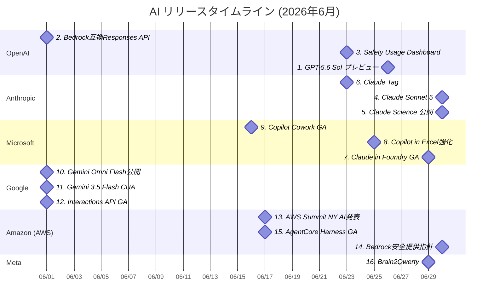

# AI技術動向レポート: 2026年6月

> **対象企業**: OpenAI / Anthropic / Microsoft / Google / Amazon (AWS) / Meta
> **調査期間**: 2026-06-01 〜 2026-06-30
> **生成日**: 2026-07-05
> **対象読者**: クラウド・オンプレ基盤の企画・開発・運用を担当するIT技術者

---

## 目次

- [リリースタイムライン](#リリースタイムライン)
- [注目トピックス](#注目トピックス)
  - [AI活用提案サマリー](#ai活用提案サマリー)

---

## リリースタイムライン

各トピックスのリリース時期を以下に示す。数字はトピックスの番号と対応している。

---

## 注目トピックス

> 16 件のアップデートを注目度順に紹介します。

### AI活用提案サマリー

今月のリリース・アップデートの中で、**クラウド・オンプレ基盤担当のIT技術者**が特に注目すべき活用シナリオをまとめます。

| 優先度 | サービス・機能 | 活用シナリオ | 期待効果 |
| ------ | ------------- | ------------ | -------- |
| ★★★ | GPT-5.6 Sol プレビュー | 既存RAG基盤で高難度推論ジョブを段階移行 | 推論品質向上と設計判断の精度改善 |
| ★★★ | Claude Sonnet 5 | エンタープライズ業務エージェントの標準モデル候補として評価 | 高性能と運用コストの両立 |
| ★★★ | Claude in Microsoft Foundry GA | Azure統制下でのマルチモデル運用を本番化 | ガバナンス維持と導入速度向上 |
| ★★☆ | OpenAI Bedrock互換Responses API | AWS上の既存運用へOpenAI API互換経路を追加 | マルチクラウド冗長化の実現 |
| ★★☆ | Safety Usage Dashboard | テナント単位で安全ブロック監視を可視化 | 監査対応と異常検知の効率化 |
| ★★☆ | Work IQ / Copilot Cowork | M365業務データ連携の自動化フロー設計 | ナレッジ作業時間の短縮 |
| ★★☆ | Gemini Omni Flash / Interactions API | 低遅延エージェントAPIへの移行検証 | 応答遅延と運用コストの最適化 |
| ★★☆ | Bedrock AgentCore Harness GA | エージェント実行基盤の標準化 | 開発速度向上と運用負荷低減 |
| ★☆☆ | Brain2Qwerty | 医療・支援領域向けBCI実証の技術調査 | 新規ユースケース探索 |

> **凡例**: ★★★ 今すぐ評価推奨 / ★★☆ 近い将来検討 / ★☆☆ 動向ウォッチ推奨

---

### 1. GPT-5.6 Sol プレビュー

| 項目 | 内容 |
| ---- | ---- |
| 会社 | OpenAI |
| カテゴリ | 新製品リリース |
| リリース日 | 2026年6月26日 |

**次世代フロンティアモデルのプレビュー提供が始まり、高難度推論ワークロードの更新候補が明確化。**

- GPT-5.6 Sol がプレビュー公開され、次世代モデル系統が提示された。
- 既存 GPT-5.x 運用と比較し、難易度の高い推論タスク向け評価軸を作りやすい。
- 本番全面移行前に、精度・遅延・コストの三点比較を進める段階に入った。

🔗 **情報源**:
- [GPT-5.6 Sol プレビュー](https://openai.com/ja-JP/index/previewing-gpt-5-6-sol/)

💡 **AI活用提案**:
- まずは社内の難問QAや設計レビュー支援で A/B 評価を実施し、既存モデルとの差分を定量化してみてください。

---

### 2. OpenAIモデルがAmazon Bedrock互換エンドポイントで利用可能に

| 項目 | 内容 |
| ---- | ---- |
| 会社 | OpenAI |
| カテゴリ | 新サービスリリース |
| リリース日 | 2026年6月1日 |

**OpenAI Responses API 互換で Bedrock 連携が可能となり、マルチクラウド実装の選択肢が拡大。**

- OpenAI モデルが Bedrock 上で Responses API 互換エンドポイント経由で利用可能になった。
- リージョンごとに対応機能は差があるが、既存API実装の再利用余地が高い。
- クラウド間フェイルオーバーやベンダー分散戦略を設計しやすくなった。

📘 **用語解説**:
- **Responses API**: OpenAIの統合生成API。会話・ツール利用を一貫して扱える。

🔗 **情報源**:
- [OpenAI Changelog (Jun 1, 2026)](https://developers.openai.com/api/docs/changelog)

💡 **AI活用提案**:
- 既存 OpenAI SDK 実装に Bedrock 互換経路を追加し、障害時切替の実地演習を検討してみてください。

---

### 3. Safety Usage Dashboard 公開

| 項目 | 内容 |
| ---- | ---- |
| 会社 | OpenAI |
| カテゴリ | 機能アップデート |
| リリース日 | 2026年6月23日 |

**安全性ブロックの可視化機能が追加され、運用監査と不正利用検知の実務性が向上。**

- Safety Usage Dashboard が API プラットフォームに追加された。
- safety_identifier 単位でブロック状況を確認でき、運用監視に使いやすい。
- 組織の利用ルール違反や攻撃的入力の傾向分析が可能になった。

🔗 **情報源**:
- [OpenAI Changelog (Jun 23, 2026)](https://developers.openai.com/api/docs/changelog)

💡 **AI活用提案**:
- SIEM 連携を前提に、ダッシュボード指標を週次レビューへ組み込み、異常検知運用を標準化してみてください。

---

### 4. Claude Sonnet 5 発表

| 項目 | 内容 |
| ---- | ---- |
| 会社 | Anthropic |
| カテゴリ | 新製品リリース |
| リリース日 | 2026年6月30日 |

**Sonnet系の最新世代が公開され、コーディング・エージェント・業務推論の基準が更新。**

- Claude Sonnet 5 が公開され、フロンティア性能の更新が示された。
- コード生成や業務推論の実運用に向けた中核モデル候補として注目される。
- 既存 Sonnet 世代からの置換判断に必要な比較検証フェーズに入った。

🔗 **情報源**:
- [Introducing Claude Sonnet 5](https://www.anthropic.com/news/claude-sonnet-5)

💡 **AI活用提案**:
- 既存 Sonnet ベースの業務フローで精度・レイテンシ・単価を比較し、段階的なモデル切替計画を作成してみてください。

---

### 5. Claude Science が利用可能に

| 項目 | 内容 |
| ---- | ---- |
| 会社 | Anthropic |
| カテゴリ | 新サービスリリース |
| リリース日 | 2026年6月30日 |

**研究者向けAIワークベンチが公開され、監査可能な成果物生成と計算資源活用を統合。**

- Claude Science は研究作業向けにツール統合と成果物の監査性を重視した構成。
- 研究ワークフローの再現性とチーム共有を強化しやすい。
- 科学計算・実験記録・解析補助の統合運用に向く。

🔗 **情報源**:
- [Claude Science, an AI workbench for scientists, is now available](https://www.anthropic.com/news/claude-science-ai-workbench)

💡 **AI活用提案**:
- 研究開発部門の実験記録テンプレートと連携し、AI生成物の監査ログを残す運用を先行導入してみてください。

---

### 6. Claude Tag 提供開始

| 項目 | 内容 |
| ---- | ---- |
| 会社 | Anthropic |
| カテゴリ | 機能アップデート |
| リリース日 | 2026年6月23日 |

**チームでの Claude 活用を前提とした新しい協働インターフェースが追加。**

- Claude Tag が公開され、チーム利用時の共同作業体験が強化された。
- タスクや会話の共有単位を明確化し、運用の属人化を減らしやすい。
- 複数担当でのレビューや引き継ぎに適した運用モデルを取りやすい。

🔗 **情報源**:
- [Introducing Claude Tag](https://www.anthropic.com/news/introducing-claude-tag)

💡 **AI活用提案**:
- 運用チーム内でタグ運用ルールを定義し、問い合わせ対応や調査タスクの引き継ぎ品質向上を検討してみてください。

---

### 7. Claude in Microsoft Foundry が GA

| 項目 | 内容 |
| ---- | ---- |
| 会社 | Microsoft |
| カテゴリ | 新サービスリリース |
| リリース日 | 2026年6月29日 |

**Foundry上で Claude 提供が一般提供化し、企業統制下での本番導入障壁が低下。**

- Claude in Microsoft Foundry が GA となり、Azureホストで本番利用しやすくなった。
- NVIDIA GB300 Blackwell Ultra 基盤の記載があり、性能面の期待値が高い。
- モデル選定を Azure 統制と一体で進める設計が取りやすい。

📘 **用語解説**:
- **GA**: General Availability。一般提供開始を指す。

🔗 **情報源**:
- [Claude in Microsoft Foundry is now generally available](https://azure.microsoft.com/en-us/blog/claude-in-microsoft-foundry-is-now-generally-available/)

💡 **AI活用提案**:
- 既存Azure環境のネットワーク・監査要件を維持したまま、複数モデル比較のPoCを短期実施してみてください。

---

### 8. Copilot in Excel の金融分析機能強化

| 項目 | 内容 |
| ---- | ---- |
| 会社 | Microsoft |
| カテゴリ | 機能アップデート |
| リリース日 | 2026年6月25日 |

**Excel上でのCopilot活用が高度化し、財務系分析ワークフローの自動化余地が拡大。**

- Copilot in Excel が Frontier Finance 文脈で機能強化された。
- 財務分析業務での実用性を前面に出し、現場適用の明確化が進んだ。
- スプレッドシート中心の業務でAI活用を定着させやすい。

🔗 **情報源**:
- [Copilot in Excel: Built for the era of Frontier Finance](https://www.microsoft.com/en-us/microsoft-365/blog/2026/06/25/copilot-in-excel-built-for-the-era-of-frontier-finance/)

💡 **AI活用提案**:
- 月次決算や予実分析の定型レポート作成を対象に、Copilot利用前後の工数差を測定してみてください。

---

### 9. Copilot Cowork が一般提供開始

| 項目 | 内容 |
| ---- | ---- |
| 会社 | Microsoft |
| カテゴリ | 新サービスリリース |
| リリース日 | 2026年6月16日 |

**長時間・複数ステップ業務を支援する Cowork が GA 化し、実務投入フェーズへ移行。**

- Copilot Cowork が GA となり、長時間タスク支援の実運用がしやすくなった。
- 既存 M365 文脈で会話から実行までをつなぐ体験を拡張。
- 部門横断の業務自動化シナリオに適用しやすい。

🔗 **情報源**:
- [Copilot Cowork is now generally available](https://www.microsoft.com/en-us/microsoft-365/blog/2026/06/16/copilot-cowork-is-now-generally-available/)

💡 **AI活用提案**:
- 問い合わせ一次対応や週次レポート作成など、複数ステップ業務でCowork導入効果を評価してみてください。

---

### 10. Nano Banana 2 Lite と Gemini Omni Flash 提供開始

| 項目 | 内容 |
| ---- | ---- |
| 会社 | Google |
| カテゴリ | 新製品リリース |
| リリース日 | 2026年6月 |

**低遅延・高コスト効率を狙うモデル群が拡充され、エージェント実装の選択肢が増加。**

- Gemini Omni Flash と Nano Banana 2 Lite の提供開始が案内された。
- 速度とコスト性能を重視するユースケースに適した位置づけ。
- 大規模導入前の軽量モデル検証を進めやすい。

🔗 **情報源**:
- [Start building with Nano Banana 2 Lite and Gemini Omni Flash](https://blog.google/innovation-and-ai/models-and-research/gemini-models/gemini-omni-flash-nano-banana-2-lite/)
- [Google Cloud: Nano Banana 2 Lite and Gemini Omni Flash](https://cloud.google.com/blog/products/ai-machine-learning/nano-banana-2-lite-and-gemini-omni-flash-available)

💡 **AI活用提案**:
- 社内チャットボットや一次分類など高トラフィック用途で、軽量モデルへの置換効果を試算してみてください。

---

### 11. Gemini 3.5 Flash に computer use が追加

| 項目 | 内容 |
| ---- | ---- |
| 会社 | Google |
| カテゴリ | 機能アップデート |
| リリース日 | 2026年6月 |

**Gemini 3.5 Flash に操作実行能力が加わり、UI操作を伴うエージェント設計が現実的に。**

- Gemini 3.5 Flash で computer use 機能が発表された。
- ツール連携だけでなく、画面操作を含むタスク自動化設計が可能。
- 業務システム操作の自動化PoCに向いたアップデート。

📘 **用語解説**:
- **computer use**: モデルが画面理解と操作を組み合わせて作業する機能。

🔗 **情報源**:
- [Introducing computer use in Gemini 3.5 Flash](https://blog.google/innovation-and-ai/models-and-research/gemini-models/introducing-computer-use-gemini-3-5-flash/)

💡 **AI活用提案**:
- 定型のWeb運用手順を対象に、手作業工程をどこまで自動化できるかを限定範囲で検証してみてください。

---

### 12. Interactions API が主要インターフェースに

| 項目 | 内容 |
| ---- | ---- |
| 会社 | Google |
| カテゴリ | 機能アップデート |
| リリース日 | 2026年6月 |

**Geminiモデル／エージェント向けの統合API方針が示され、実装標準化が進展。**

- Interactions API が Gemini モデルとエージェント向け主要IFとして案内された。
- 会話履歴・ツールループ・ストリーミングを統合しやすい設計。
- 複数アプリでの実装共通化や保守性向上に寄与する。

🔗 **情報源**:
- [Interactions API: our primary interface for Gemini models and agents](https://blog.google/innovation-and-ai/technology/developers-tools/interactions-api-general-availability/)

💡 **AI活用提案**:
- 新規プロジェクトは Interactions API を前提にし、将来のエージェント拡張を見据えたSDK標準化を検討してみてください。

---

### 13. AWS Summit New York 2026 でAgentic AI関連発表

| 項目 | 内容 |
| ---- | ---- |
| 会社 | Amazon (AWS) |
| カテゴリ | 注目ニュース |
| リリース日 | 2026年6月17日 |

**Bedrock AgentCore や Kiro を含む発表が集中し、AWSのエージェント基盤戦略が明確化。**

- AWS Summit NY 2026 の主要発表として Agentic AI スタックが提示された。
- Bedrock AgentCore や関連サービスの強化方針が示された。
- 企業導入を前提にした開発から運用までの流れが整理された。

🔗 **情報源**:
- [Top announcements of the AWS Summit in New York, 2026](https://aws.amazon.com/blogs/aws/top-announcements-of-the-aws-summit-in-new-york-2026/)

💡 **AI活用提案**:
- AWS利用組織では、エージェント基盤の標準アーキテクチャを再整理し、運用責任分界を先に定義してみてください。

---

### 14. Bedrock向けフロンティアモデルの安全提供方針

| 項目 | 内容 |
| ---- | ---- |
| 会社 | Amazon (AWS) |
| カテゴリ | 機能アップデート |
| リリース日 | 2026年6月30日 |

**フロンティアモデル提供時の安全設計が整理され、エンタープライズ導入の判断材料が増加。**

- AWS が Bedrock を含むAIサービスの安全提供方針を公開した。
- セキュリティ統制を保ちながら新モデルを提供する考え方を明示。
- 高規制領域での採用時に参照しやすい実務指針となる。

🔗 **情報源**:
- [Safely Releasing Frontier Models to Customers](https://aws.amazon.com/blogs/machine-learning/safely-releasing-frontier-models-to-customers/)

💡 **AI活用提案**:
- 自社のモデル導入審査フローに、この方針をマッピングしてリスク評価項目の棚卸しを進めてみてください。

---

### 15. Bedrock AgentCore Harness が GA

| 項目 | 内容 |
| ---- | ---- |
| 会社 | Amazon (AWS) |
| カテゴリ | 新サービスリリース |
| リリース日 | 2026年6月17日 |

**AgentCore実行基盤の一般提供により、エージェント本番化の実装・運用手順を標準化しやすくなった。**

- AgentCore harness が一般提供となり、設定中心で本番エージェントを実行しやすくなった。
- モデル、ツール、スキル、命令の定義を基盤側で扱える構成が示された。
- 開発初期のオーケストレーション実装負荷を下げ、運用までのリードタイム短縮が期待できる。

🔗 **情報源**:
- [Top announcements of the AWS Summit in New York, 2026](https://aws.amazon.com/blogs/aws/top-announcements-of-the-aws-summit-in-new-york-2026/)
- [AWS の最新情報（機械学習）](https://aws.amazon.com/about-aws/whats-new/machine-learning/)

💡 **AI活用提案**:
- 既存のエージェントPoCを AgentCore harness 前提の構成へ移し、実装工数と運用手順の差分を比較してみてください。

---

### 16. Brain2Qwerty: 非侵襲で脳波から文字入力を復元

| 項目 | 内容 |
| ---- | ---- |
| 会社 | Meta |
| カテゴリ | 注目ニュース |
| リリース日 | 2026年6月29日 |

**非侵襲BCIで文字入力復元を示し、AIによる新しい支援インターフェースの可能性を提示。**

- Brain2Qwerty は手術不要の計測で脳活動から文字入力復元を目指す研究。
- 医療・支援技術向けに、AIとインターフェース技術の接点を広げる内容。
- 直近の商用化よりも、中長期の応用可能性評価が中心となる。

📘 **用語解説**:
- **BCI**: Brain-Computer Interface。脳活動を計算機入力へ変換する技術。

🔗 **情報源**:
- [From Brain Waves to Words: Brain2Qwerty Offers a New Path to Communication Without Surgery](https://ai.meta.com/blog/brain2qwerty-brain-ai-human-communication/)

💡 **AI活用提案**:
- 研究開発テーマとして、支援技術や産業安全分野での将来適用シナリオ整理を進めてみてください。

---

## 収集できなかった情報源

- OpenAI Help Center一覧: https://help.openai.com/en/articles/ （HTTP 404、再試行時も同様）
  - 代替取得成功: https://help.openai.com/en/articles/6825453-chatgpt-release-notes
  - 代替取得成功: https://help.openai.com/en/articles/10128477-chatgpt-enterprise-edu-release-notes
  - 代替取得成功: https://help.openai.com/en/articles/11391654-chatgpt-business-release-notes
- Amazon Bedrock What's New: https://aws.amazon.com/bedrock/whats-new/ （HTTP 404、再試行時も同様）
  - 代替取得成功: https://aws.amazon.com/about-aws/whats-new/machine-learning/
  - 代替取得成功: https://aws.amazon.com/about-aws/whats-new/

---

## カバレッジサマリー

- OpenAI: 3件
- Anthropic: 3件
- Microsoft: 3件
- Google: 3件
- Amazon (AWS): 3件
- Meta: 1件
- 合計: 16件
